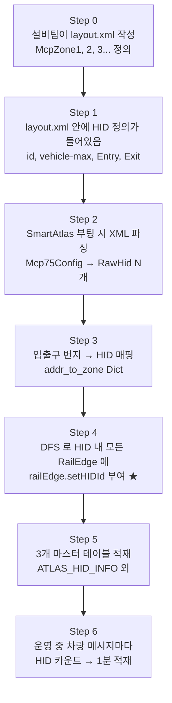
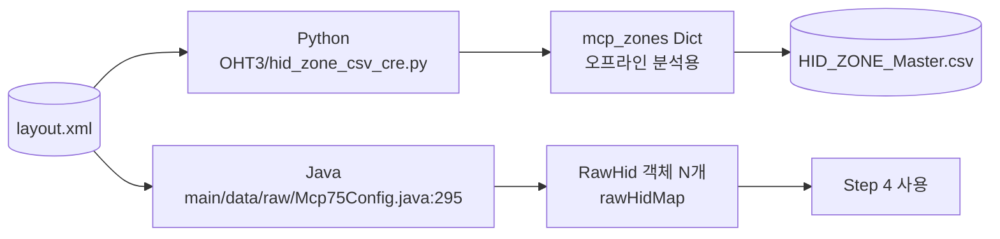
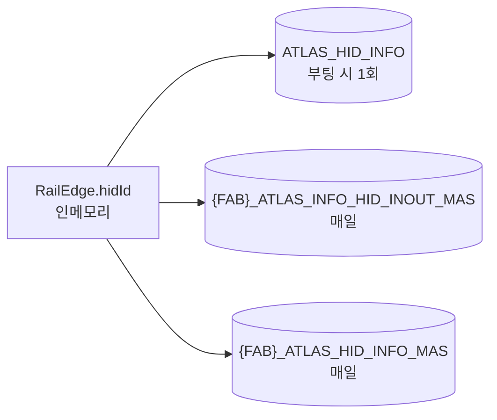
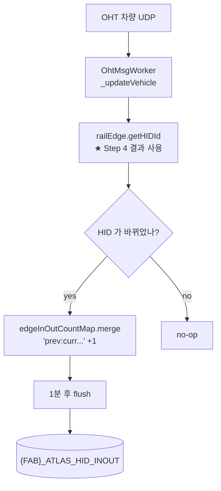

# HID 구역 생성과 사용 — 전체 통합본 (한 파일)

> 처음부터 끝까지 한 페이지로. layout.xml 에서 시작해 운영 중 사용까지.

---

## 🎯 핵심 한 줄

**HID 구역은 우리가 만든 게 아니라 `layout.xml` 의 `<group name="McpZone{N}">` 을
그대로 읽은 것.** 우리가 한 일은 (1) XML 파싱, (2) RailEdge 에 hidId 부여 (DFS),
(3) DB 적재, (4) 실시간 카운트.

---

## 📐 전체 흐름 한 장



---

# Step 1 · layout.xml 에 모든 게 들어있다

## XML 구조 (실제 형태)

```xml
<group name="McpZone1" type="mcpzone.McpZone">
    <param key="id" value="1"/>                   ← HID 번호
    <param key="vehicle-max" value="20"/>          ← 차량 한계
    <param key="vehicle-precaution" value="15"/>   ← 경고치
    <param key="type" value="0"/>

    <group name="Entry1" type="mcpzone.Entry">
        <param key="start" value="3048"/>          ← 들어오는 곳 시작
        <param key="end"   value="3023"/>          ← 들어오는 곳 끝
        <param key="stop-zcu" value="ZCU01"/>
    </group>
    <group name="Entry2" type="mcpzone.Entry">
        <param key="start" value="3100"/>
        <param key="end"   value="3120"/>
    </group>

    <group name="Exit1" type="mcpzone.Exit">
        <param key="start" value="3500"/>          ← 나가는 곳
        <param key="end"   value="3525"/>
    </group>
</group>

<group name="McpZone2" type="mcpzone.McpZone">
    <param key="id" value="2"/>
    ...
</group>
```

## 추출되는 정보

| 추출값 | XML 위치 | HID1 의 예 |
|---|---|---|
| `HID_ID` | `<param key="id">` | 1 |
| `Vehicle_Max` | `<param key="vehicle-max">` | 20 |
| `Vehicle_Precaution` | `<param key="vehicle-precaution">` | 15 |
| `IN_COUNT` | `<Entry>` 그룹 개수 | 2 |
| `OUT_COUNT` | `<Exit>` 그룹 개수 | 2 |
| `IN_Lanes` | Entry start→end 모음 | "3048→3023; 3100→3120" |
| `OUT_Lanes` | Exit start→end 모음 | "3500→3525" |
| `ZCU_ID` | Entry 의 `stop-zcu` | ZCU01 |

**HID1, HID2 ... 의 번호는 layout.xml 만든 설비팀이 매긴 것.**

---

# Step 2 · XML 파싱 (Python + Java)



## Python 핵심 코드 (`OHT3/hid_zone_csv_cre.py:136-309`)

```python
for line in lines:
    # 1. McpZone 그룹 발견
    if '<group name="McpZone' in line and 'mcpzone.McpZone"' in line:
        match = re.search(r'McpZone(\d+)', line)
        current_mcp_id = int(match.group(1))   # 1, 2, 3...

    # 2. 파라미터 추출
    if '<param' in line:
        key   = re.search(r'key="([^"]+)"',   line).group(1)
        value = re.search(r'value="([^"]*)"', line).group(1)
        if in_entry:
            if key == 'start': entry_start = int(value)
            elif key == 'end': entry_end   = int(value)
        elif in_exit:
            if key == 'start': exit_start = int(value)
            elif key == 'end': exit_end   = int(value)
        else:
            if key == 'id':              current_zone_id = int(value)
            elif key == 'vehicle-max':   vehicle_max     = int(value)

    # 3. 그룹 종료
    if '</group>' in line:
        if in_entry:  current_entries.append((entry_start, entry_end))
        elif in_exit: current_exits.append((exit_start, exit_end))
        else:  # McpZone 종료
            mcp_zones[current_zone_id] = {
                'entries': current_entries.copy(),
                'exits':   current_exits.copy(),
                'vehicle_max': vehicle_max,
                ...
            }
```

## Java 핵심 코드 (`Mcp75Config.java:295-308`)

```java
RawHid rh = new RawHid(
    id,                    // ← <param key="id">
    subId,
    loopEntrySet,          // ← <Entry> (start, end) Set
    exitSet,               // ← <Exit> (start, end) Set
    vhlMax,                // ← <param key="vehicle-max">
    vhlPreCaution,         // ← <param key="vehicle-precaution">
    zoneCarrierType,
    autoCloseSet,
    autoCloseVhlCntDisable,
    autoCloseVhlCntRestore
);
this.rawHidMap.put(rh.getId() + ":" + rh.getSubId(), rh);
```

→ `RawHid` 클래스 한 인스턴스 = HID 1개. 시스템 전체 RawHid 개수 = HID 개수.

---

# Step 3 · 번지 → HID 매핑 (Python)

```python
def build_addr_to_zone_mapping(mcp_zones):
    addr_to_zone = {}
    for zone_id, zone_data in mcp_zones.items():
        # Entry/Exit 의 start/end 모두 이 HID 에 매핑
        for entry_start, entry_end in zone_data['entries']:
            addr_to_zone[entry_start] = {'zone_id': zone_id}
            addr_to_zone[entry_end]   = {'zone_id': zone_id}
        for exit_start, exit_end in zone_data['exits']:
            addr_to_zone[exit_start] = {'zone_id': zone_id}
            addr_to_zone[exit_end]   = {'zone_id': zone_id}
    return addr_to_zone
```

→ **단순**. Entry/Exit 의 4번지 모두 그 HID 에 매핑.

⚠ 이건 입출구만 매핑. HID 내부의 중간 RailEdge 들은 **Step 4 의 자바 DFS 가 채움**.

---

# Step 4 · RailEdge 에 hidId 부여 (자바 DFS) ★

## 위치 / 시점
- `main/java/.../util/DataService.java:3104-3175`
- 로그: `"Setting Initial HID"`
- 시점: **서버 부팅 중 단 1회**

## 왜 DFS?

```
[Entry start 3048] --- 3050 --- 3055 --- 3060 --- [Exit end 3525]
                       ↑       ↑       ↑
                  중간 RailEdge 들 (XML 에 명시 없음)
```

→ 시작에서 출발해 인접 엣지 따라가며 Exit 만날 때까지 모두 수집.

## 자바 코드

```java
this._START_PROCESS_LOG(++sequence, "Setting Initial HID");

for (String mcpName : mcp75ConfigMap.keySet()) {
    final Map<String, RawHid> mapHid = mcp75ConfigMap.get(mcpName).getRawHidMap();

    pool.submit(() -> mapHid.values().parallelStream().forEach(rawHid -> {
        final Set<String> mapRailEdgeId = new HashSet<>();
        final int hidId = rawHid.getId();                  // 1, 2, 3...

        // Entry 각각에 대해
        for (LoopEntry loopEntry : rawHid.getLoopEntrySet()) {
            final int fromAddress = loopEntry.getEntryLaneStart();   // 3048
            final int toAddress   = loopEntry.getEntryLaneEnd();     // 3023

            // 시작 엣지 찾기
            final ConcurrentLinkedQueue<RawEdge> rawEdges =
                    mapFromNode2RawEdgeMap.get(mcpName).get(fromAddress);

            for (RawEdge rawEdge : rawEdges) {
                if (rawEdge.toNode == toAddress) {
                    // ★ DFS 시작 — Exit 만날 때까지 인접 엣지 수집
                    this._collectZoneElement(
                            mapFromNode2RawEdgeMap.get(mcpName),
                            rawHid.getExitSet(),       // 멈춤 조건
                            rawEdge,
                            mapRailEdgeId,             // 결과 누적
                            1
                    );
                    break;
                }
            }
        }

        // ★ 수집된 모든 RailEdge 에 hidId 부여
        for (String railEdgeId : mapRailEdgeId) {
            RailEdge railEdge = tmpRailEdgeMap.get(railEdgeId);
            railEdge.setHIDId(hidId);                   // ← 이 한 줄!
        }
    })).get();
}

this._insertHidDataIntoLogpresso(tmpHidMap);
```

## DFS 종료 조건 3가지

1. **Exit set 도달** (정상)
2. **Dead end** (그래프 종단)
3. **이미 방문한 엣지** (사이클 방지)

## 결과

```
부팅 전:  RailEdge.hidId = -1 (초기값)
부팅 후:  RailEdge.hidId = 1 또는 2 또는 ... (DFS 로 박힘)
```

---

# Step 5 · DB 마스터 테이블 적재



## 3개 테이블

| 테이블 | 적재 시점 | 내용 |
|---|---|---|
| `ATLAS_HID_INFO` | 부팅 시 1회 | HID → 번지 목록 |
| `{FAB}_ATLAS_INFO_HID_INOUT_MAS` | 매일 | HID 인접 관계 (FROM_HIDID → TO_HIDID) |
| `{FAB}_ATLAS_HID_INFO_MAS` | 매일 | HID 메타 (레일길이/속도/포트수/VHL_MAX) |

## ATLAS_HID_INFO 적재 (DataService.java:4406-4444)

```java
for (Map.Entry<String, List<String>> entry : tmpHidMap.entrySet()) {
    String[] split = entry.getKey().split(":");   // "M14A:MCP01:001"
    String fabId   = split[0];
    String mcpName = split[1];
    int    hidId   = Integer.parseInt(split[2]);

    for (String address : entry.getValue()) {
        Tuple t = new Tuple();
        t.put("FAB_ID", fabId);
        t.put("MCP_NM", mcpName);
        t.put("HID_ID", hidId);
        t.put("ADDR_NO", address);
        logpressoData.add(t);
    }
}
LogpressoAPI.setInsertTuples("ATLAS_HID_INFO", logpressoData, 20);
```

## 일 배치 마스터 (HidEdgeInOutUpdateMasterBatch.java)

```java
// 1) HID 인접 관계
Map<Integer, Double>       railLenByHid    = new HashMap<>();
Map<Integer, List<Double>> velocitiesByHid = new HashMap<>();
Map<Integer, Integer>      portCntByHid    = new HashMap<>();

for (AbstractEdge ae : edgeMap.values()) {
    if (!(ae instanceof RailEdge)) continue;
    RailEdge re = (RailEdge) ae;
    int hidId = re.getHIDId();
    if (hidId <= 0) continue;

    railLenByHid.merge(hidId, re.getLength(), Double::sum);
    velocitiesByHid.computeIfAbsent(hidId, k -> new ArrayList<>()).add(re.getMaxVelocity());
    portCntByHid.merge(hidId, re.getPortIdList().size(), Integer::sum);
}
// → HID_INFO_MAS 적재
```

---

# Step 6 · 운영 중 실시간 사용



## `_processHidInout()` (OhtMsgWorkerRunnable.java:473-522)

```java
private void _processHidInout(int currentHidId, Vhl vehicle, FunctionItem fi) {
    int previousHidId = vehicle.getHidId();      // 직전 메시지의 HID

    if (previousHidId != currentHidId) {         // HID 가 바뀌면 카운트
        // 차량/설비 정보 추출
        String vhlName = ...
        String eqpName = ...

        // 보조 값
        int    vhlCountLimit  = RawHid.vhlMax
        int    vhlPrecaution  = RawHid.vhlPreCaution
        double freeFlowSpeed  = 현재 HID 의 RailEdge velocity 평균
        int    hidValue       = DataSet.hidVehicleCountMap[fab:mcp:HID]

        // 11필드 키
        String edgeKey = String.format("%03d:%03d:%s:%s:%s:%s:%s:%s:%s:%s:%s",
                previousHidId, currentHidId, this.fabId, this.mcpName,
                vehicle.getFabId(), vhlName, eqpName,
                vhlCountLimit, vhlPrecaution, freeFlowSpeed, hidValue);

        // 카운트 +1
        DataService.getDataSet().getEdgeInOutCountMap()
                .merge(edgeKey, 1, Integer::sum);
    }
}
```

## 1분 후 적재 (HidEdgeInOutQueueFlushBatch)

```java
// 1) 누적 map 통째로 swap
HashMap<String, Integer> copyMap = new HashMap<>();
DataSet.edgeInOutCountMap.forEach((k, v) -> copyMap.put(new String(k), v));
DataSet.setEdgeInOutCountMap(new ConcurrentHashMap<>());

// 2) Tuple 14개 컬럼으로 변환
for (entry : copyMap) {
    String[] parts = entry.getKey().split(":");
    Tuple t = new Tuple();
    t.put("EVENT_DATE",      eventDate);
    t.put("EVENT_DT",        eventDt);
    t.put("FROM_HIDID",      Integer.parseInt(parts[0]));
    t.put("TO_HIDID",        Integer.parseInt(parts[1]));
    t.put("TRANS_CNT",       entry.getValue());
    t.put("FAB_ID",          parts[4]);
    t.put("VHL_ID",          parts[5]);
    t.put("EQP_ID",          parts[6]);
    t.put("MCP_NM",          parts[3]);
    t.put("ENV",             Env.getEnv());
    t.put("VHL_COUNT_LIMIT", parts[7]);
    t.put("VHL_PRECAUTION",  parts[8]);
    t.put("FREE_FLOW_SPEED", parts[9]);
    t.put("HID_VALUE",       parts[10]);
    fabIdTuples[parts[2]].add(t);
}

// 3) FAB 별로 적재
LogpressoAPI.setInsertTuples(fabId + "_ATLAS_HID_INOUT", tuples, 100);
```

---

# 자주 묻는 질문

## Q1. HID 번호는 누가 정했나?
**설비팀**이 layout.xml 만들 때 매김. 우리는 그 ID 를 그대로 가져옴.

## Q2. HID 안에 어떤 RailEdge 가 속하는지 어떻게 알았나?
layout.xml 에는 Entry/Exit 입출구만 있음. **자바가 부팅 시 DFS** 로 그 사이의 모든 RailEdge 를 찾아서 `setHIDId()`.

## Q3. IN_COUNT 가 왜 3 이고 OUT_COUNT 는 2 인가?
XML 안에 `<group name="Entry...">` 가 3개, `<group name="Exit...">` 가 2개라서.

## Q4. HID 가 바뀌면 어떻게 하나?
layout.xml 새로 받아서 **서버 재기동**. 실시간 변경은 안 됨.

## Q5. 운영 중 데이터 흐름은?
차량 메시지마다 `railEdge.getHIDId()` 로 현재 HID 확인 → 직전과 다르면 `edgeInOutCountMap` 에 카운트 → 1분 후 `{FAB}_ATLAS_HID_INOUT` 에 적재.

## Q6. HID_INOUT 스위치만 켜면 되나?
**아니. VHL_CNT 도 같이 켜야** `vehicle.setHidId()` 가 호출됨. 그게 안 되면 `previousHidId` 가 영구히 -1 로 고정되어 매 메시지마다 잘못 전환 인식.

---

# 핵심 코드 한 줄 점프

| 알고 싶은 것 | 파일:라인 |
|---|---|
| layout.xml 안 McpZone 구조 | 직접 layout.xml 열기 |
| Python XML 파싱 | `OHT3/hid_zone_csv_cre.py:136-309` |
| Python addr→zone | `OHT3/hid_zone_csv_cre.py:310-334` |
| Java RawHid 생성 | `main/.../data/raw/Mcp75Config.java:295-308` |
| Java HID 부팅 빌드 | `main/.../util/DataService.java:3104-3175` |
| Java setHIDId 호출 | `main/.../util/DataService.java:3157` |
| Java DFS 재귀 | `main/.../util/DataService.java:3612` `_collectZoneElement` |
| Java Logpresso 적재 | `main/.../util/DataService.java:4406` `_insertHidDataIntoLogpresso` |
| Java 일배치 마스터 갱신 | `main/.../batch/HidEdgeInOutUpdateMasterBatch.java` |
| Java 실시간 카운트 | `main/.../process/OhtMsgWorkerRunnable.java:473-522` `_processHidInout` |
| Java 1분 flush | `main/.../batch/HidEdgeInOutQueueFlushBatch.java` |

---

# DB 테이블 정리

| 테이블 | 주기 | 컬럼 (요약) |
|---|---|---|
| `ATLAS_HID_INFO` | 부팅 | FAB_ID, MCP_NM, HID_ID, ADDR_NO |
| `{FAB}_ATLAS_INFO_HID_INOUT_MAS` | 일 | FROM_HIDID, TO_HIDID, EDGE_ID, EDGE_TYPE (IN/OUT/INTERNAL) |
| `{FAB}_ATLAS_HID_INFO_MAS` | 일 | HID_ID, RAIL_LEN_TOTAL, FREE_FLOW_SPEED, VHL_MAX |
| `{FAB}_ATLAS_HID_INOUT` | 1분 | EVENT_DT, FROM_HIDID, TO_HIDID, TRANS_CNT, VHL_ID, EQP_ID |
| `ATLAS_OHT_VHL_CNT` | 10/30/60초 | HID 별 현재 차량 수 |

---

# 끝.

레이아웃 XML → 파싱 → DFS → DB → 실시간 카운트. 이게 전부.
