# `{FAB}_ATLAS_HID_INOUT` 적재 로직 — 기존 코드 분석

`ALT/decoded_main/` 의 SmartAtlas 기존 소스가 `{FAB}_ATLAS_HID_INOUT`
(예: `M14A_ATLAS_HID_INOUT`) 테이블에 데이터를 어떻게 적재하는지에 대한
End-to-End 분석. **신규/제안 코드 없음** — 디코딩된 원본 그대로의 흐름.

---

## 0. 등장 인물

| 파일 | 위치 | 역할 |
|---|---|---|
| `OhtMsgWorkerRunnable.java` | `process/` | OHT UDP 메시지 처리 워커. HID 변경 감지 후 카운트 누적 |
| `Vhl.java` | `map/` | 차량 객체. `hidId` 필드 보유 (직전 HID) |
| `RailEdge.java` | `map/edge/` | 레일 엣지. `getHIDId()`, `getVelocity()` |
| `DataSet.java` | `data/` | 전역 인메모리 저장소. `edgeInOutCountMap` 보유 |
| `DataService.java` | `util/` | DataSet 접근 게이트웨이, FabPropertiesMap, hidVehicleCountMap |
| `RawHid.java` | `data/raw/` | layout.xml 의 HID 정의 (vhlMax, vhlPreCaution) |
| `FunctionItem.java` | `environment/type/` | fab+mcp 별 기능 스위치 (`HID_INOUT` 포함) |
| `HidEdgeInOutQueueFlushBatch.java` | `batch/` | Quartz Job. 분단위로 map drain → Logpresso insert |
| `LogpressoAPI.java` | `db/logpresso/` | Logpresso bulk insert wrapper |
| `Env.java` | `environment/` | `getEnv()`, `getSwitchMap()` |

---

## 1. 전체 아키텍처

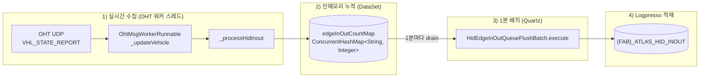

---

## 2. 단계 1 — 실시간 수집: `_processHidInout()`

**위치:** `OhtMsgWorkerRunnable.java:473-522`
**호출 조건:** `OhtMsgWorkerRunnable.java:310` — `functionItem.getUseFunction(FunctionType.HID_INOUT)` 가 true 일 때

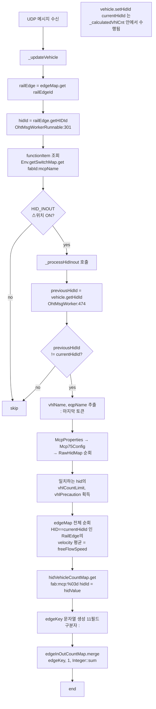

### 2.1 `edgeKey` 문자열 포맷 (11개 필드, `:` 구분)

`OhtMsgWorkerRunnable.java:515-517`:

```java
String edgeKey = String.format("%03d:%03d:%s:%s:%s:%s:%s:%s:%s:%s:%s",
        previousHidId, currentHidId, this.fabId, this.mcpName,
        vehicle.getFabId(), vhlName, eqpName,
        vhlCountLimit, vhlPrecaution, freeFlowSpeed, hidValue);
```

| 인덱스 | 필드 | 출처 |
|---|---|---|
| 0 | `previousHidId` (zero-pad 3) | `vehicle.getHidId()` (갱신 전 값) |
| 1 | `currentHidId` (zero-pad 3) | `railEdge.getHIDId()` |
| 2 | `fabId` | 워커의 fab (`this.fabId`) |
| 3 | `mcpName` | 워커의 mcp (`this.mcpName`) |
| 4 | `vhlFabId` | `vehicle.getFabId()` (DB에 적재되는 FAB_ID) |
| 5 | `vhlName` | `vehicle.getId()` 의 `:` 뒤 토큰 |
| 6 | `eqpName` | `vehicle.getEqpId()` 의 `:` 뒤 토큰 |
| 7 | `vhlCountLimit` | `RawHid.getVhlMax()` |
| 8 | `vhlPrecaution` | `RawHid.getVhlPreCaution()` |
| 9 | `freeFlowSpeed` | 현재 HID RailEdge 들의 `velocity` 평균 |
| 10 | `hidValue` | `hidVehicleCountMap[fab:mcp:%03d]` |

### 2.2 보조값 계산 상세

**`vhlCountLimit` / `vhlPrecaution`** — `OhtMsgWorkerRunnable.java:484-495`

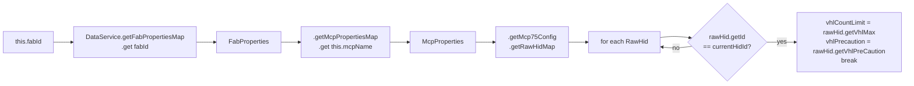

**`freeFlowSpeed`** — `OhtMsgWorkerRunnable.java:498-509`

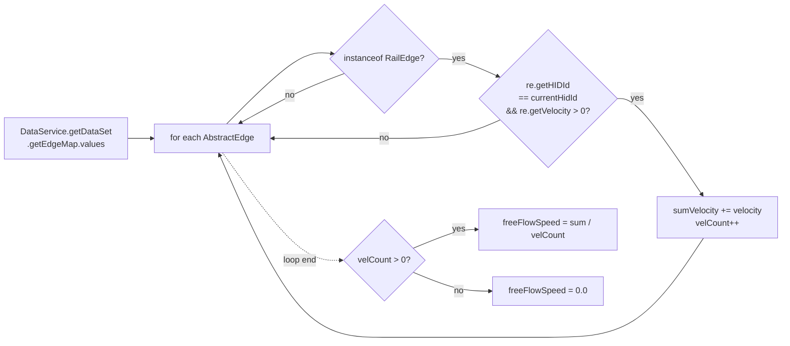

**`hidValue`** — `OhtMsgWorkerRunnable.java:512-513`

```java
String hidKey = this.fabId + ":" + this.mcpName + ":" + String.format("%03d", currentHidId);
int hidValue = DataService.getDataSet().getHidVehicleCountMap().getOrDefault(hidKey, 0);
```

`hidVehicleCountMap` 은 `_calculatedVhlCnt()` (`VHL_CNT` 스위치) 에서
HID 진입/이탈에 따라 증감되는 별도 맵.

### 2.3 카운트 누적 — `DataSet.edgeInOutCountMap`

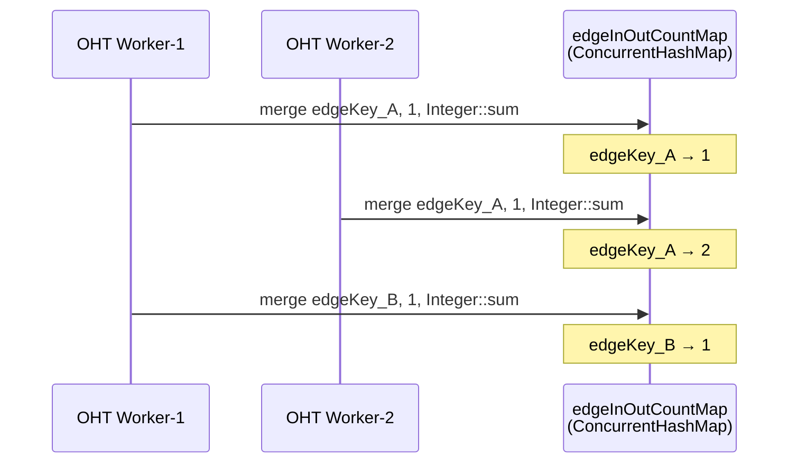

`DataSet.java:116` :
```java
private ConcurrentHashMap<String, Integer> edgeInOutCountMap = new ConcurrentHashMap<>();
```
- 키: 위 11필드 문자열
- 값: 누적 전환 횟수
- `merge(k, 1, Integer::sum)` 으로 동시성 안전하게 증가

---

## 3. 단계 2 — 1분 배치: `HidEdgeInOutQueueFlushBatch.execute()`

**위치:** `HidEdgeInOutQueueFlushBatch.java:31-141`
**트리거:** Quartz Job (운영 cron 별도 등록)

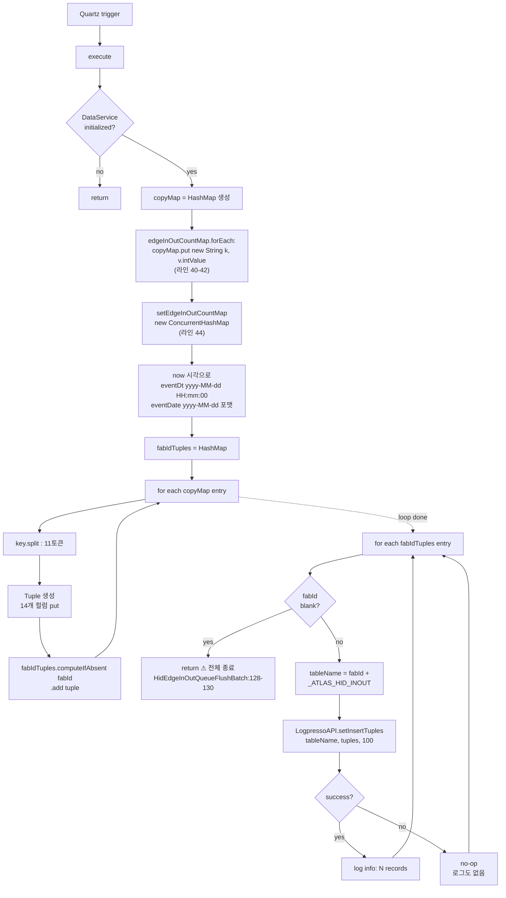

### 3.1 Tuple 빌드 (라인 72-86)

```java
Tuple tuple = new Tuple();
tuple.put("EVENT_DATE",       eventDate);     // yyyy-MM-dd
tuple.put("EVENT_DT",         eventDt);       // yyyy-MM-dd HH:mm:00
tuple.put("FROM_HIDID",       fromHidId);     // parts[0]
tuple.put("TO_HIDID",         toHidId);       // parts[1]
tuple.put("TRANS_CNT",        transCnt);      // entry.getValue()
tuple.put("FAB_ID",           vhlFabId);      // parts[4] (차량의 fab)
tuple.put("VHL_ID",           vhlId);         // parts[5]
tuple.put("EQP_ID",           eqpId);         // parts[6]
tuple.put("MCP_NM",           mcpName);       // parts[3]
tuple.put("ENV",              Env.getEnv());
tuple.put("VHL_COUNT_LIMIT",  vhlCountLimit); // parts[7]
tuple.put("VHL_PRECAUTION",   vhlPrecaution); // parts[8]
tuple.put("FREE_FLOW_SPEED",  freeFlowSpeed); // parts[9]
tuple.put("HID_VALUE",        hidValue);      // parts[10]
```

⚠ `fabId` 그루핑 키는 `parts[2]` (워커의 fab), DB 적재 컬럼 `FAB_ID` 는 `parts[4]` (차량의 fab). **두 값이 다를 수 있음.**

### 3.2 `{FAB}_ATLAS_HID_INOUT` 컬럼 매핑 표

| DB 컬럼 | 타입 | 출처 (edgeKey 파싱 후) | 비고 |
|---|---|---|---|
| `EVENT_DATE` | string | flush 시각 | `yyyy-MM-dd` |
| `EVENT_DT` | string | flush 시각 | `yyyy-MM-dd HH:mm:00` (분 단위로 절삭) |
| `FROM_HIDID` | int | `parts[0]` | 직전 HID (0 = OUTSIDE) |
| `TO_HIDID` | int | `parts[1]` | 현재 HID |
| `TRANS_CNT` | int | `entry.getValue()` | 1분 누적 전환 횟수 |
| `FAB_ID` | string | `parts[4]` | `vehicle.getFabId()` — 차량 소속 FAB |
| `VHL_ID` | string | `parts[5]` | 차량 short name |
| `EQP_ID` | string | `parts[6]` | 설비 short name |
| `MCP_NM` | string | `parts[3]` | MCP 이름 |
| `ENV` | string | `Env.getEnv()` | 실행 환경 |
| `VHL_COUNT_LIMIT` | int | `parts[7]` | RawHid.vhlMax |
| `VHL_PRECAUTION` | int | `parts[8]` | RawHid.vhlPreCaution |
| `FREE_FLOW_SPEED` | double | `parts[9]` | 현 HID 평균 속도 |
| `HID_VALUE` | int | `parts[10]` | 현 HID 차량 수 |

### 3.3 적재 — `LogpressoAPI.setInsertTuples`

`HidEdgeInOutQueueFlushBatch.java:135`:
```java
String tableName = fabId + "_ATLAS_HID_INOUT";
boolean success = LogpressoAPI.setInsertTuples(tableName, tuples, 100);
```
- 테이블명 prefix = **워커의 fabId** (`parts[2]`)
- ⚠ **세 번째 인자 `100` 은 batch size 가 아니라 `timeoutSecond`** — `LogpressoAPI.java:408`
  ```java
  public static boolean setInsertTuples(String table, List<Tuple> tuples, int timeoutSecond)
  ```
- 한 번의 호출에 `tuples` 전체가 `Logpresso.insert()` 로 그대로 들어감
- `setInsertTuplesInternal` 이 `TimeoutException` 던지면 **API 내부에서 자동 3회 재시도** (`LogpressoAPI.java:413-419`)
- 그 외 예외는 `logger.error("insert Error ", e)` 후 `false` 반환 (라인 423-425)

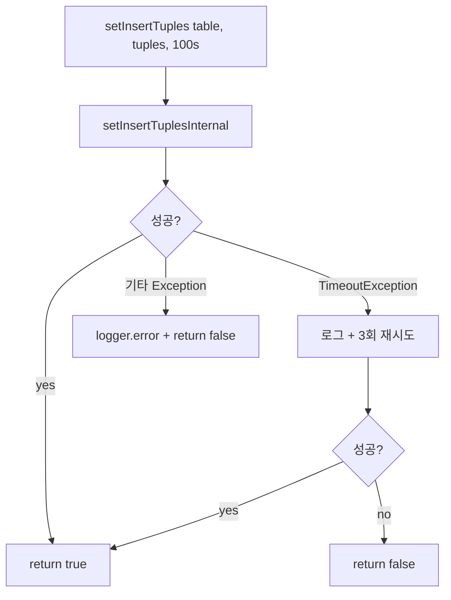

---

## 3.4 ⚠ HID_INOUT 의 숨겨진 의존성 — VHL_CNT 스위치

`_processHidInout` 은 `previousHidId` 를 `vehicle.getHidId()` 에서 읽지만,
`vehicle.setHidId(currentHidId)` 호출은 **`_calculatedVhlCnt` 안에서만** 일어남
(`OhtMsgWorkerRunnable.java:455`). 즉:

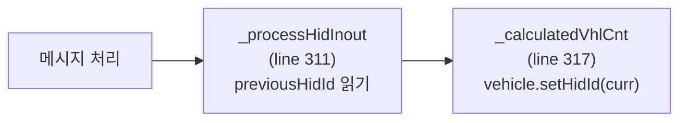

→ **`VHL_CNT` 스위치가 OFF 이면 `vehicle.setHidId()` 가 절대 호출되지 않음**

`Vhl.java:452` 초기값:
```java
public int hidId = -1;   // 위치했던 HID 값 기억
```

따라서 `VHL_CNT` 가 OFF 이고 `HID_INOUT` 만 ON 인 경우의 동작:

| 메시지 # | `vehicle.getHidId()` | `currentHidId` | `previousHidId != currentHidId` | 결과 |
|---|---|---|---|---|
| 1 | -1 (초기값) | 5 | true | `-001:005:...` merge → +1 |
| 2 | -1 (안 바뀜!) | 5 | true | `-001:005:...` merge → +1 |
| 3 | -1 | 5 | true | merge → +1 |
| ... | -1 | 5 | true | **메시지마다 무한 증가** |

→ `FROM_HIDID = -1` 로 `M14A_ATLAS_HID_INOUT` 에 엄청난 양 적재됨.

**결론: `HID_INOUT` 은 사실상 `VHL_CNT` 와 함께 켜져야 정상 동작**.

추가로 `HID_VALUE` 컬럼 값도 `_calculatedVhlCnt` 가 관리하는
`hidVehicleCountMap` 에서 읽으므로, `VHL_CNT` OFF 면 **`HID_VALUE` = 0 으로 고정**.

---

## 4. 동시성 — drain 의 race window

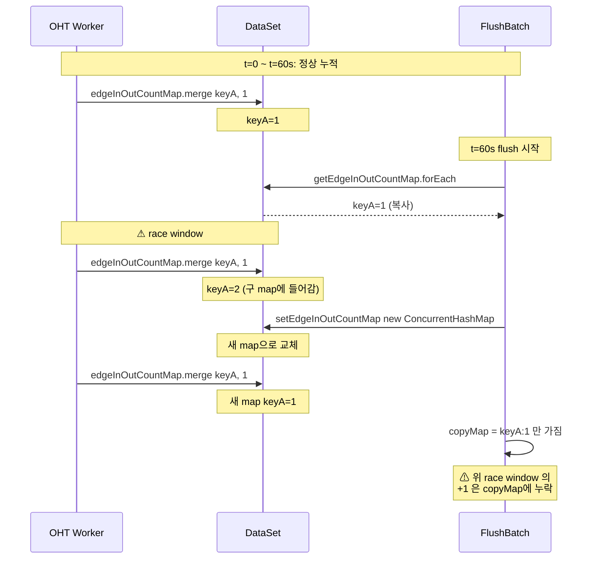

**관찰:** forEach 가 완전히 끝나기 전에 들어오는 증가분은 옛 map 에 들어가지만,
forEach 가 끝난 직후 `setEdgeInOutCountMap(new ...)` 이전에 들어오는 증가분도
옛 map 에 들어가며, **이는 copyMap 에 반영되지 않은 채 GC 됨.**
운영상 대규모 손실은 아니지만 정확한 카운트 보장은 없음.

---

## 5. 빈 fabId 처리의 함정

`HidEdgeInOutQueueFlushBatch.java:124-130`:

```java
for (var entry : fabIdTuples.entrySet()) {
    var fabId = entry.getKey();
    var tuples = entry.getValue();

    if (Strings.isBlank(fabId)) {
        return;          // ⚠ continue 가 아닌 return
    }
    ...
}
```

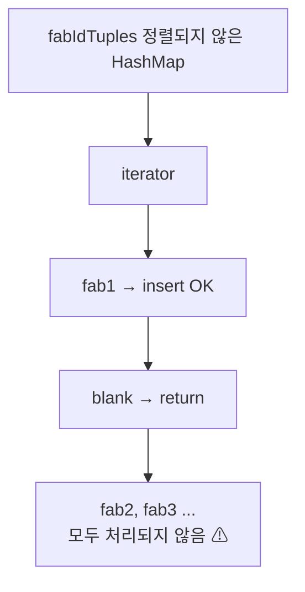

`HashMap` 의 iteration 순서는 비결정적이므로, **blank fabId 가 어디서 등장하느냐에
따라 그 뒤의 정상 FAB 들이 통째로 누락**될 수 있음.

---

## 6. `HID_INOUT` 스위치 흐름

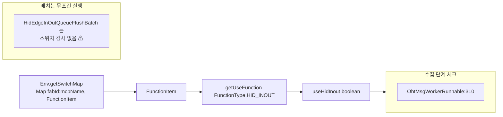

**관찰:** flush 배치는 스위치를 검사하지 않으므로, 누군가 우회 경로로
`edgeInOutCountMap` 에 키를 넣어두면 스위치 OFF 인 mcp 의 데이터도 적재됨.
실제로는 `_processHidInout` 만 이 맵에 쓰므로 문제 없지만, 코드상 명시적
방어는 없음.

---

## 6.1 `transCnt` 변수 — `_processHidInout` 내부

`OhtMsgWorkerRunnable.java:519-520`:
```java
int transCnt = DataService.getDataSet().getEdgeInOutCountMap()
        .merge(edgeKey, 1, Integer::sum);
```
- `merge` 반환값 (현재 누적 카운트) 을 `transCnt` 에 받지만 **사용처 없음** (dead variable)
- 실제 DB `TRANS_CNT` 컬럼 값은 flush 시점의 `entry.getValue()`
  (`HidEdgeInOutQueueFlushBatch.java:70`) 에서 구해짐

---

## 6.2 워커 `fabId` vs 차량 `vhl.getFabId()`

| 필드 | 출처 | 용도 |
|---|---|---|
| `this.fabId` | `messageQueue.getFabId()` (`BizDataInitializer.java:183, 190`) | 메시지를 수신한 fab. **테이블명 prefix** + RawHid/edgeMap 조회 키 |
| `vehicle.getFabId()` | Vhl 객체 자체 | DB `FAB_ID` **컬럼값** |

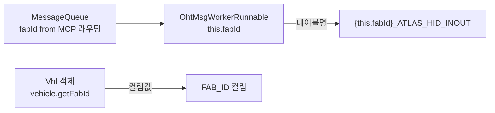

두 값이 다른 경우 (예: 타 fab 차량이 임시 이동) **테이블은 워커 fab 쪽에 저장
되지만 `FAB_ID` 컬럼은 차량 fab 으로 기록**되어 join 시 주의 필요.

---

## 6.3 `edgeKey` 의 음수 처리 — `String.format("%03d", -1)`

`hidId` 초기값 -1 인 상태에서 첫 메시지가 들어오면:
- `String.format("%03d", -1)` → `"-01"` (sign 포함 3자리)
- `String.format("%03d", 5)`  → `"005"`
- 결과 `edgeKey` = `"-01:005:..."`

flush 의 `Integer.parseInt("-01")` 은 정상으로 `-1` 반환 → DB `FROM_HIDID = -1`.
**음수 HID 가 적재될 수 있음을 인지 필요**.

---

## 6.4 flush 배치는 `HID_INOUT` 스위치를 검사하지 않음

`HidEdgeInOutQueueFlushBatch.execute()` 는 `edgeInOutCountMap` 의 모든 entry 를
무조건 적재함. 실제로 이 맵에 쓰는 코드는 `_processHidInout` 하나이고 거기서
이미 스위치 ON 일 때만 들어가므로 동작상 문제는 없지만, **코드 레벨 방어는 없음**.

---

## 6.5 flush 실패 시 로깅 부재

`HidEdgeInOutQueueFlushBatch.java:137-139`:
```java
if (success) {
    logger.info("HID Edge flush: {} - {} records", tableName, tuples.size());
}
// else: 로그 없음
```
- `LogpressoAPI.setInsertTuples` 가 `false` 반환해도 별도 로그 없음
- LogpressoAPI 내부에 `"insert Error"` 는 찍지만 호출 측 컨텍스트(테이블/행수) 부족

---

## 6.6 동시 실행 방어 (Quartz @DisallowConcurrentExecution) 없음

`HidEdgeInOutQueueFlushBatch` 클래스에 `@DisallowConcurrentExecution` 미부착.
이전 flush 가 길어져 다음 trigger 와 겹치면 동일 Job 인스턴스가 동시에 두 번
실행될 수 있음. 다만 첫 호출에서 `setEdgeInOutCountMap(new ...)` 으로 비웠으므로
두 번째 실행의 `copyMap` 은 거의 비어있어 실질 손해는 작음.

---

## 6.7 Quartz 스케줄 등록 위치

`HidEdgeInOutQueueFlushBatch` 의 cron 등록부는 **디코딩된 소스 안에 없음** — 외부
Quartz config 파일(properties/xml) 에서 등록되는 것으로 보임. 클래스 javadoc
(`OhtMsgWorkerRunnable.java:471`) 의 주석으로만 _"1분 배치 플러시, 하루 1회
마스터 테이블 업데이트"_ 라고 명시되어 있음.

---

## 7. 1분 사이클 타임라인

```mermaid
gantt
    title 1분 사이클의 데이터 흐름
    dateFormat HH:mm:ss
    axisFormat %H:%M:%S

    section OHT 워커들
    이벤트 수집 (continuous)         :active, w, 00:00:00, 120s

    section DataSet
    edgeInOutCountMap 누적           :active, m1, 00:00:00, 60s
    새 map (다음 사이클)             :m2, 00:01:00, 60s

    section Flush 배치
    drain & insert                   :crit, f1, 00:01:00, 2s

    section Logpresso
    EVENT_DT = 00:01:00 적재        :crit, db1, 00:01:01, 1s
```

- `EVENT_DT` 는 **flush 실행 시각의 분 단위 절삭값**이므로 실제 이벤트 발생
  시점과 최대 ~60초 차이 존재
- `TRANS_CNT` 는 직전 1분 동안의 전환 횟수 (정확히는 직전 drain 이후)

---

## 8. 데이터 예시

차량 `M14A:OHT:0123` 이 1분 동안 HID 5→7 로 3번 전환 (왕복) 했다고 가정:

**edgeKey 예** (`OhtMsgWorkerRunnable:515` 포맷 적용):
```
005:007:M14A:MCP01:M14A:0123:EQP07:50:40:1.85:8
```

**1분 후 flush 결과:** `M14A_ATLAS_HID_INOUT` 에 1행 insert:

| EVENT_DATE | EVENT_DT | FROM_HIDID | TO_HIDID | TRANS_CNT | FAB_ID | VHL_ID | EQP_ID | MCP_NM | ENV | VHL_COUNT_LIMIT | VHL_PRECAUTION | FREE_FLOW_SPEED | HID_VALUE |
|---|---|---|---|---|---|---|---|---|---|---|---|---|---|
| 2026-05-18 | 2026-05-18 09:23:00 | 5 | 7 | 3 | M14A | 0123 | EQP07 | MCP01 | PROD | 50 | 40 | 1.85 | 8 |

7→5 방향(역방향) 전환은 **별개 row** 로 적재됨 (`FROM_HIDID`/`TO_HIDID` 가
키의 일부이므로).

---

## 9. 호출 그래프 (요약)

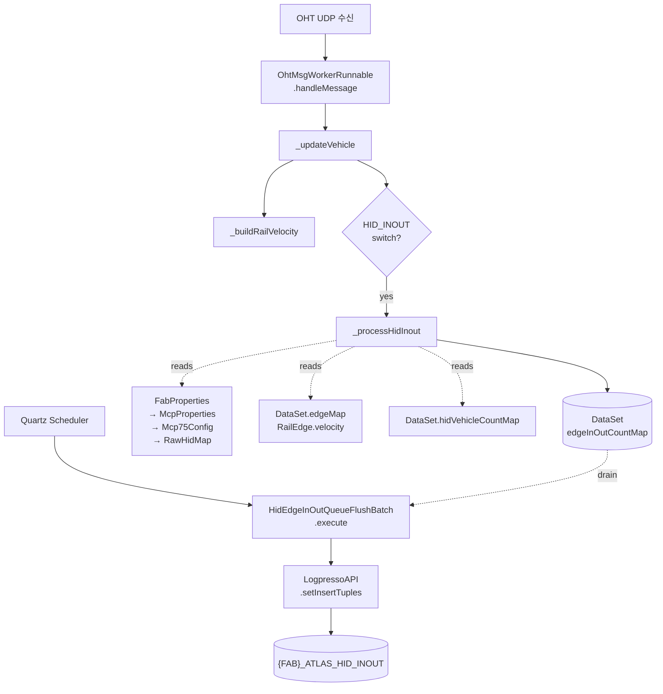

---

## 10. 라인 번호 인덱스

| 동작 | 파일:라인 |
|---|---|
| HID_INOUT 스위치 분기 | `OhtMsgWorkerRunnable.java:310` |
| `_processHidInout` 정의 | `OhtMsgWorkerRunnable.java:473` |
| HID 변경 검사 | `OhtMsgWorkerRunnable.java:474, 477` |
| vhl/eqp short name 추출 | `OhtMsgWorkerRunnable.java:478-481` |
| RawHid 매칭 (limit/precaution) | `OhtMsgWorkerRunnable.java:484-495` |
| freeFlowSpeed 계산 | `OhtMsgWorkerRunnable.java:498-509` |
| hidValue 조회 | `OhtMsgWorkerRunnable.java:512-513` |
| edgeKey 포맷 | `OhtMsgWorkerRunnable.java:515-517` |
| `edgeInOutCountMap.merge` | `OhtMsgWorkerRunnable.java:519-520` |
| `edgeInOutCountMap` 필드 선언 | `DataSet.java:116` |
| flush copy & swap | `HidEdgeInOutQueueFlushBatch.java:38-46` |
| Tuple put 14컬럼 | `HidEdgeInOutQueueFlushBatch.java:72-86` |
| fabId 그룹핑 | `HidEdgeInOutQueueFlushBatch.java:88-92` |
| 빈 fabId → return | `HidEdgeInOutQueueFlushBatch.java:128-130` |
| 테이블명 조합 | `HidEdgeInOutQueueFlushBatch.java:132-133` |
| Logpresso insert | `HidEdgeInOutQueueFlushBatch.java:135` |
| 성공 시 로그 (실패는 무로그) | `HidEdgeInOutQueueFlushBatch.java:137-139` |
| tibrv 송신 (주석 처리) | `HidEdgeInOutQueueFlushBatch.java:96-121` |
| `setInsertTuples` 시그니처 (3rd arg = timeoutSecond) | `LogpressoAPI.java:408` |
| Logpresso TimeoutException 3회 재시도 | `LogpressoAPI.java:413-419` |
| `Vhl.hidId` 초기값 = -1 | `Vhl.java:452` |
| `vehicle.setHidId` 호출 (유일한 곳) | `OhtMsgWorkerRunnable.java:455` |
| 워커 생성 (fabId 주입) | `BizDataInitializer.java:190` |

---

## 11. 누락 없이 정리한 행위 체크리스트

`{FAB}_ATLAS_HID_INOUT` 한 행이 만들어지기까지 모든 단계:

1. OHT UDP 메시지가 MCP 라우팅 fab 기준으로 큐잉됨 (`messageQueue.getFabId()`)
2. `BizDataInitializer` 가 `new OhtMsgWorkerRunnable(fabId, ...)` 로 워커 생성 (`BizDataInitializer.java:190`)
3. 워커가 `_updateVehicle` 에서 token 파싱, `vehicle.set*` 호출
4. `railEdge = edgeMap.get(railEdgeId)` 로 RailEdge 획득 후 `_buildRailVelocity` 로 속도 갱신
5. `hidId = railEdge.getHIDId()` 로 현재 HID 결정 (line 301)
6. `FunctionItem fi = Env.getSwitchMap().get(fabId + ":" + mcpName)` 조회 (line 307)
7. `fi.getUseFunction(HID_INOUT) == true` 이면 `_processHidInout(hidId, vehicle, fi)` 호출 (line 310-311)
8. `_processHidInout` 내부:
   - `previousHidId = vehicle.getHidId()` (초기 -1)
   - 같으면 no-op, 다르면 다음 단계 진행
   - `vehicle.getId()`, `vehicle.getEqpId()` 의 `:` 뒤 토큰 추출
   - `FabPropertiesMap[fabId].McpPropertiesMap[mcp].Mcp75Config.RawHidMap` 순회로 `vhlCountLimit`, `vhlPrecaution` 매칭
   - `edgeMap` 전체 순회하며 `HID==curr && velocity>0` 인 RailEdge 의 평균속도 → `freeFlowSpeed`
   - `hidVehicleCountMap[fab:mcp:%03d]` → `hidValue`
   - 11필드 `String.format(":")` 으로 `edgeKey` 조립
   - `edgeInOutCountMap.merge(edgeKey, 1, Integer::sum)` — return 값 (`transCnt`) 은 사용 안 함
9. 같은 메시지 처리 안에서 `_calculatedVhlCnt` (VHL_CNT 스위치) 가 실행되어
   `vehicle.setHidId(curr)` 호출 → 다음 메시지 때 정상 비교 가능
   **(VHL_CNT 꺼져 있으면 hidId 가 -1 로 고정되어 매 메시지마다 중복 카운트)**
10. Quartz trigger (외부 설정) 가 1분마다 `HidEdgeInOutQueueFlushBatch.execute()` 호출
11. `DataService.initialized` 검사 (line 32)
12. `edgeInOutCountMap.forEach` 로 `copyMap` 에 복사 (`new String`, `intValue`) — defensive copy (line 40-42)
13. `setEdgeInOutCountMap(new ConcurrentHashMap<>())` 로 원본 비움 (line 44)
14. 현재 시각으로 `eventDate`, `eventDt` 포맷 생성 (분 절삭, line 49-53)
15. `copyMap.entrySet()` 순회:
    - `key.split(":")` 11 토큰
    - `Tuple` 에 14컬럼 put
    - `fabIdTuples[parts[2]].add(tuple)` (워커 fab 기준 그루핑, line 88-92)
16. `fabIdTuples.entrySet()` 순회 (line 124):
    - blank fabId 만나면 `return` (⚠ 전체 종료, line 128-130)
    - 아니면 `tableName = fabId + "_ATLAS_HID_INOUT"` (line 133)
    - `LogpressoAPI.setInsertTuples(tableName, tuples, 100)` 호출 (100s timeout)
    - 내부적으로 TimeoutException 시 3회 재시도, 기타 예외 시 false 반환
    - 성공이면 info 로그, 실패면 무로그

## 12. ⚠ 이전 문서에서 정정된 내용

| 항목 | 이전 (잘못) | 정정 |
|---|---|---|
| `setInsertTuples` 의 3번째 인자 `100` | "배치 크기 100 tuple" | **timeoutSecond (100초)** |
| `_processHidInout` 의 의존성 | 독립 동작으로 서술 | **VHL_CNT 스위치 켜져 있어야 정상** |
| `previousHidId` 초기값 | 명시 안 함 | **-1 (`Vhl.java:452`)** |
| LogpressoAPI 재시도 | 언급 없음 | TimeoutException 시 3회 자동 재시도 |
| flush 실패 처리 | "no-op" | 별도 로그 없이 다음 fab 진행 |
| `transCnt` 변수 | 언급 없음 | merge 반환값을 받지만 미사용 (dead var) |
| 워커 fabId 와 차량 fabId | 같다고 가정 | 다를 수 있음 — 테이블 prefix vs FAB_ID 컬럼 |
