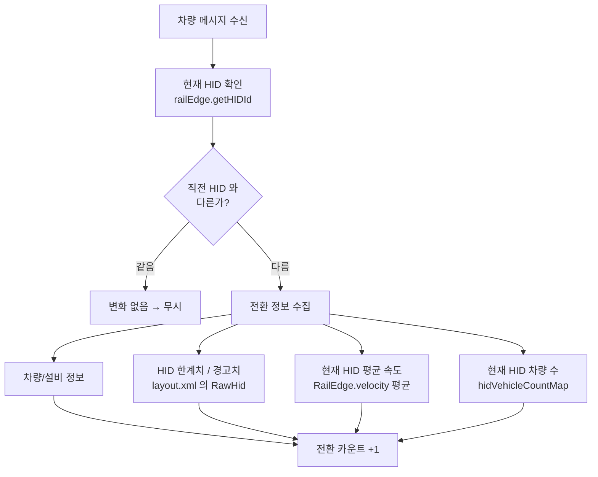
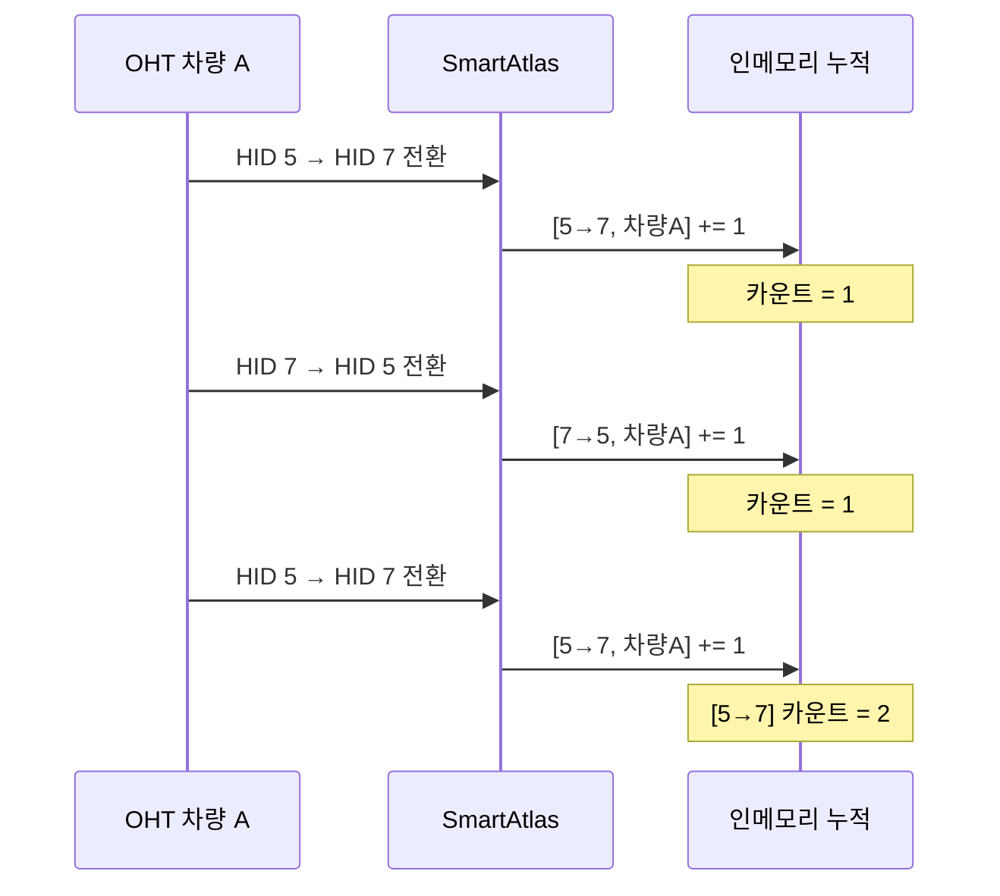
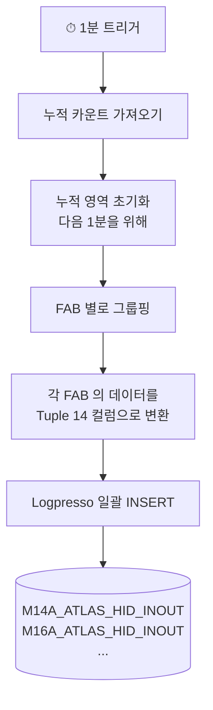
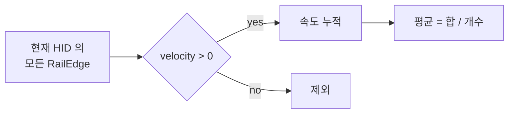
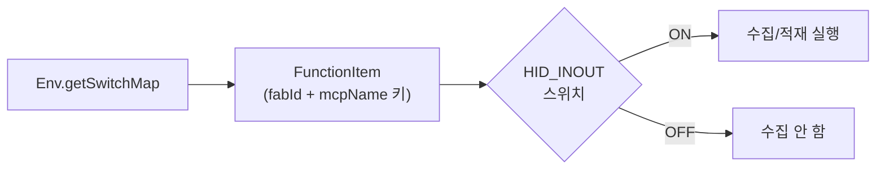
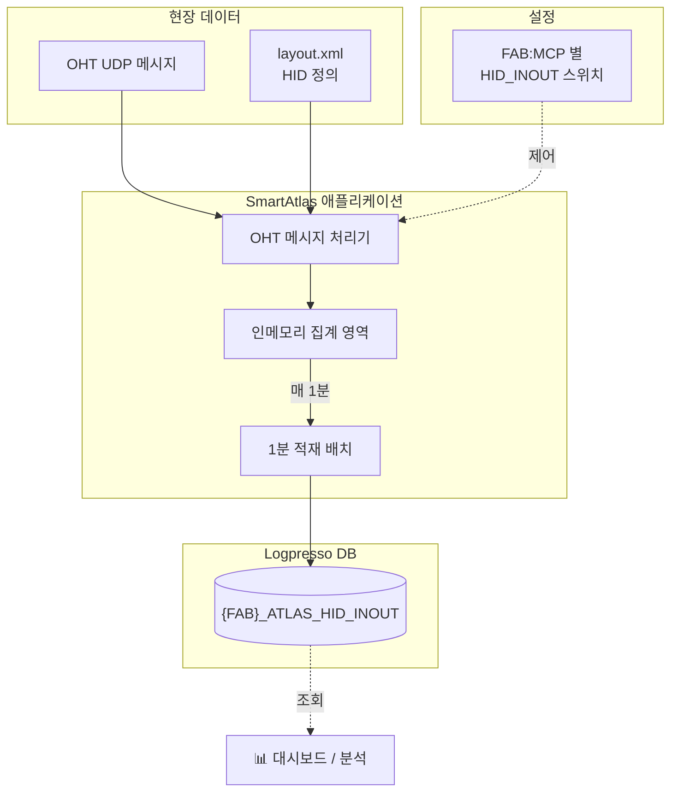

# HID IN/OUT 적재 로직

> **테이블:** `{FAB}_ATLAS_HID_INOUT` (예: `M14A_ATLAS_HID_INOUT`)
> **목적:** OHT 차량의 HID 구간 간 전환 이력을 1분 단위로 집계하여 적재

---

## 1. 개요

SmartAtlas 시스템은 OHT 차량이 운행 중 **HID 구역 경계를 넘어 이동할 때마다**
그 사실을 감지하고 1분간 누적한 후 Logpresso DB 에 저장합니다.

이를 통해 다음을 모니터링할 수 있습니다:
- HID 구역 간 차량 이동 트래픽 패턴
- 특정 HID 의 진입/이탈 빈도
- 시간대별 차량 흐름과 평균 속도
- 차량 밀집도 (`HID_VALUE`) 와 한계치 (`VHL_COUNT_LIMIT`) 비교

---

## 2. 전체 구조

```mermaid
flowchart LR
    OHT[🚙 OHT 차량<br/>운행 메시지] --> W[⚙ 메시지 처리기<br/>OhtMsgWorkerRunnable]
    W --> M[💾 인메모리 누적<br/>HID 전환 카운트]
    M -- "매 1분" --> F[📦 적재 배치<br/>HidEdgeInOutQueueFlushBatch]
    F --> DB[(🗄 Logpresso<br/>{FAB}_ATLAS_HID_INOUT)]
```

세 단계로 데이터가 흐릅니다:

1. **수집** — OHT 메시지에서 HID 전환 발생을 실시간 감지
2. **누적** — 1분 동안 동일 조건의 전환을 카운트로 합산
3. **적재** — 매 분 단위로 DB 에 일괄 저장

---

## 3. 단계별 동작

### 3.1 수집 단계

OHT 차량이 메시지를 보낼 때마다, 시스템은 차량이 위치한 RailEdge 의 HID 값을
확인합니다. 직전 메시지의 HID 와 다르면 **"HID 전환 발생"** 으로 판정합니다.



### 3.2 누적 단계

동일한 조건 (출발 HID → 도착 HID, 같은 차량/설비/MCP) 의 전환은
하나의 키로 합산됩니다. 1분 동안 같은 경로로 3번 전환이 일어났다면
`TRANS_CNT = 3` 으로 누적됩니다.



### 3.3 적재 단계 (매 분)

매 1분마다 적재 배치가 실행됩니다:



---

## 4. 적재되는 데이터 (테이블 컬럼)

| 컬럼 | 타입 | 의미 |
|---|---|---|
| `EVENT_DATE` | string | 적재 일자 (`yyyy-MM-dd`) |
| `EVENT_DT` | string | 적재 시각 (`yyyy-MM-dd HH:mm:00`, 분 단위) |
| `FROM_HIDID` | int | 출발 HID 번호 (`0` = 외부/OUTSIDE) |
| `TO_HIDID` | int | 도착 HID 번호 (`0` = 외부/OUTSIDE) |
| `TRANS_CNT` | int | 1분 누적 전환 횟수 |
| `FAB_ID` | string | 차량이 소속된 FAB |
| `VHL_ID` | string | 차량 ID |
| `EQP_ID` | string | 설비 ID |
| `MCP_NM` | string | MCP 이름 |
| `ENV` | string | 실행 환경 (개발/운영 등) |
| `VHL_COUNT_LIMIT` | int | 해당 HID 의 차량 수용 한계 (layout.xml) |
| `VHL_PRECAUTION` | int | 해당 HID 의 경고 차량 수 (layout.xml) |
| `FREE_FLOW_SPEED` | double | 해당 HID 구간의 1분 평균 속도 |
| `HID_VALUE` | int | 해당 HID 의 현재 차량 수 |

---

## 5. 데이터 예시

차량 `M14A:OHT:0123` 이 1분 동안 HID 5 → 7 로 3회 전환했다고 가정.

| EVENT_DT | FROM_HIDID | TO_HIDID | TRANS_CNT | FAB_ID | VHL_ID | EQP_ID | MCP_NM | VHL_COUNT_LIMIT | VHL_PRECAUTION | FREE_FLOW_SPEED | HID_VALUE |
|---|---|---|---|---|---|---|---|---|---|---|---|
| 2026-05-18 09:23:00 | 5 | 7 | 3 | M14A | 0123 | EQP07 | MCP01 | 50 | 40 | 1.85 | 8 |

→ 해당 차량은 1분 동안 HID 5→7 경로를 3번 통과했고, HID 7 의 현재 차량 수는
8대 (한계 50대, 경고치 40대) 이며 평균 속도는 1.85 m/s 입니다.

> 반대 방향(7→5) 전환은 **별도 행**으로 적재됩니다.

---

## 6. 보조 정보 출처

### `VHL_COUNT_LIMIT` / `VHL_PRECAUTION`
→ layout.xml 의 HID 정의 (`RawHid.vhlMax`, `RawHid.vhlPreCaution`)

### `FREE_FLOW_SPEED`
→ 현재 HID 구간에 속한 모든 RailEdge 의 실시간 속도 평균



### `HID_VALUE`
→ `hidVehicleCountMap[fab:mcp:HID번호]` 의 현재 차량 수

---

## 7. 활성화 조건

`{FAB}_ATLAS_HID_INOUT` 적재는 **FAB + MCP 별로 ON/OFF 제어**됩니다.



이 스위치는 다음 단위로 독립 제어 가능:
- `M14A:MCP01` — ON
- `M14A:MCP02` — OFF
- `M16A:MCP01` — ON
- ...

> 동일 흐름의 다른 부가 기능 (HID 구간별 차량 수 집계 등) 과 함께
> 활성화해야 모든 컬럼 값이 정확히 적재됩니다.

---

## 8. 적재 주기 요약

| 작업 | 주기 | 결과 |
|---|---|---|
| HID 전환 감지 | 실시간 (메시지 단위) | 인메모리 카운트 +1 |
| 1분 적재 | 매 분 | `{FAB}_ATLAS_HID_INOUT` INSERT |

---

## 9. 분석/활용 예시

적재된 데이터로 다음과 같은 분석이 가능합니다:

| 분석 주제 | 활용 컬럼 |
|---|---|
| HID 별 진입/이탈 빈도 | `FROM_HIDID`, `TO_HIDID`, `TRANS_CNT` |
| 차량별 이동 패턴 | `VHL_ID`, `EVENT_DT` |
| 시간대별 트래픽 | `EVENT_DT`, `TRANS_CNT` |
| 혼잡 구간 (한계 대비 실제) | `HID_VALUE` vs `VHL_COUNT_LIMIT` |
| 속도 저하 구간 | `FREE_FLOW_SPEED` |
| FAB 간 비교 | `FAB_ID` |

---

## 10. 시스템 구성 한눈에



---

*문서 버전 1.0*
