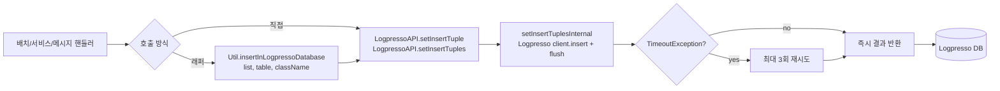

# LogpressoAPI 적재 위치 전체 인벤토리

`ALT/decoded_main/` 전체에서 Logpresso 에 데이터를 저장하는 모든 위치 (커밋된 코드 기준, 주석 처리된 호출 제외).

저장 경로는 두 가지:
1. **직접 호출** — `LogpressoAPI.setInsertTuple(s)(table, ..., timeoutSec)`
2. **유틸 래퍼** — `Util.insertInLogpressoDatabase(list, table, className)` (내부에서 `LogpressoAPI.setInsertTuples(..., 15)` 호출)

총 **활성 호출 약 50건 / 고유 테이블 약 45개**.

---

## 1. 호출 경로

---

## 2. 적재 위치 — 동적 테이블명 (`{FAB}` prefix 등)

| 테이블 패턴 | 호출 위치 | 데이터 출처 / 주기 |
|---|---|---|
| `{FAB}_ATLAS_HID_INOUT` | `HidEdgeInOutQueueFlushBatch.java:135` | HID 전환 카운트, 1분 |
| `{FAB}_ATLAS_INFO_HID_INOUT_MAS` | `HidEdgeInOutUpdateMasterBatch.java:180` | HID 엣지 마스터, 1일 |
| `{FAB}_ATLAS_HID_INFO_MAS` | `HidEdgeInOutUpdateMasterBatch.java:271` | HID 정보 마스터, 1일 |
| `oht_cmd_count` / `oht_time_avg` | `OhtPerformanceTimeMinBatch.java:540` `OhtPerformanceTimeHourBatch.java:145` | OHT 성능 통계, 1분 / 1시간 |
| `tblNm` (데이터 내 `TBLNM` 컬럼) | `DataSet.java:1105, 1111` | layout export. `TBLNM` 값에 따라 ATLAS_MAS_* 분기 (아래 §5) |

---

## 3. 적재 위치 — 직접 호출, 정적 테이블명

| 테이블 | 호출 위치 | 용도 |
|---|---|---|
| `ATLAS_COMMAND` | `CnvMsgWorkerRunnable.java:362` | CNV 명령 기록 |
| `ATLAS_HID_INFO` | `DataService.java:4438` | HID 정보 |
| `ATLAS_HIS_CNV_TASK` | `CnvTaskBatch.java:52` (상수 `TABLE_CNV_TASK`) | CNV task 이력 |
| `ATLAS_HIS_CNV_LE_STATE` | `CnvTaskBatch.java:84` (상수 `TABLE_CNV_LE_STATE`) | CNV LE state 이력 |
| `ATLAS_LOTPROCTIME_INFO_LOG` | `MesLotHisBatch.java:751` | LotProcTime 로그 |
| `ATLAS_OHT_HID_OFF` | `OhtMsgWorkerRunnable.java:652` | HID OFF 이벤트 |
| `ATLAS_OHT_RAIL_VIBRATION` | `RailVibrationBatch.java:239, 247` | 레일 진동 |
| `ATLAS_TIB_SEND_MSG_LOG` | `TibrvService.java:316` | TibRV 송신 로그 |
| `AMOS_ALARM_PARAMETER` | `AmosService.java:52` | AMOS 알람 파라미터 |
| `server_resource_apm` | `ServerResourceApmBatch.java:65` | 서버 자원 모니터링 |
| `server_resource_predict` | `ServerResourceApmBatch.java:381` | 서버 자원 예측 |
| `abnormal_detect_data` | `SystemMessageDetectBatch.java:89` | 이상 메시지 탐지 |
| `qtransfer_dashboard` | `QTransferDashBoardItemBatch.java:99` | QTransfer 대시보드 |
| `M14A_QUEUE_ANOMALY` | `AmosMinBatch.java:982` (현재는 주석) | M14A 큐 이상치 (하드코딩) |
| `M16A_BOTTLENECK_ANOMALY` | `AmosMinBatch.java:543` | M16A 병목 이상치 (하드코딩) |

---

## 4. 적재 위치 — Util 래퍼 경유

`Util.insertInLogpressoDatabase(list, tableName, className)` →
내부에서 `LogpressoAPI.setInsertTuples(tableName, list, 15)` 호출 (timeout 15s)

| 테이블 | 호출 위치 | 용도 |
|---|---|---|
| `ATLAS_OHT_VHL_OFF_ONLY` | `MonitoringControlBatch.java:187` | VHL OFF 모니터링 |
| `ATLAS_OHT_STG_CMD_MNT` | `MonitoringControlBatch.java:227` | Stage Command 모니터링 |
| `ATLAS_OHT_VHL_CNT` | `VhlCntBatch.java:101` `VhlCnt10Batch.java:87` `VhlCnt30Batch.java:88` `VhlCnt60Batch.java:88` | HID 구간 차량 수 (4개 주기) |
| `ATLAS_LOTPROCTIME_INF` | `MesLotHisBatch.java:614` | LotProcTime 정보 |
| `ATLAS_LOTPROCTIME_OPER_LOG` | `MesLotHisBatch.java:648` | 오퍼레이션 로그 |
| `ATLAS_BIZ_LOT_FUTURE_ACT_INF_LOG` | `MesLotHisBatch.java:667` | LOT 미래 액션 로그 |
| `ATLAS_MES_OPER_MAS_LOG` | `MesLotHisBatch.java:685` | MES 오퍼레이션 마스터 로그 |
| `ATLAS_LOTPROCTIME_MES_LOT_MAS_LOG` | `MesLotHisBatch.java:701` | MES LOT 마스터 로그 |
| `ATLAS_LOTPROCTIME_SFAB_LOT_MOVE_MAS_LOG` | `MesLotHisBatch.java:718` | SFAB LOT 이동 로그 |
| `ATLAS_LOTPROCTIME_FAB_TRANS` | `MesLotHisBatch.java:727` | FAB 간 이동 |
| `ATLAS_LOTPROCTIME_FLOOR_TRANS` | `MesLotHisBatch.java:735` | Floor 간 이동 |
| `ATLAS_OHT_RAIL_CUT` | `RailCutRefreshBatch.java:225` | 레일 절단 정보 |
| `ATLAS_RAIL_TRAFFIC` | `TrafficBatch.java:213` | 레일 트래픽 |
| `ATLAS_TS_PREDICT` | `QTransferPredictBatch.java:333` | QTransfer 예측 |
| `(파라미터 기반)` | `QTransferPredictBatch.java:220` | QTransfer 예측 보조 |
| `ts_log_pattern` | `AbnormalDetectBatch.java:49` | 이상 탐지 로그 패턴 |
| `bridge_layout_test` | `BridgeLayoutBatch.java:107` | 브리지 레이아웃 |
| `bridge_layout_tmp` | `BridgeLayoutDetailBatch.java:126` | 브리지 레이아웃 임시 |
| `bridge_layout_detail` | `BridgeLayoutDetailBatch.java:146` | 브리지 레이아웃 상세 |
| `bridge_judge_range` | `BridgeJudgeRangeBatch.java:85` | 브리지 판정 범위 |
| `test_hubroom_predict` | `HubroomTransPredictBatch.java:64` | Hubroom 예측 |

---

## 5. `DataSet.exportAllLayoutToLogpresso()` — TBLNM 분기

`DataSet.java:1118` 의 layout export. JSON 의 `TBLNM` 컬럼값에 따라 동일
`insertBufferdJsonData(...)` 가 다른 테이블로 분배:

| TBLNM 값 | 적재되는 데이터 |
|---|---|
| `ATLAS_MAS_AREA` | Area 마스터 |
| `ATLAS_MAS_BAY` | Bay 마스터 |
| `ATLAS_MAS_EDGE` | RailEdge / CnvEdge / etc. |
| `ATLAS_MAS_LONGEDGE` | LongEdge |
| `ATLAS_MAS_BRANCHJOINEDGE` | BranchJoinEdge |
| `ATLAS_MAS_NODE` | Node |
| `ATLAS_MAS_STATION` | Station |
| `ATLAS_MAS_VHL` | Vhl |
| `ATLAS_MAS_EQP` | Eqp |

`tblNm` 이 entry 마다 다르면 그 경계에서 한 번씩 flush.

---

## 6. 타임아웃 설정 요약

`setInsertTuple(s)` 의 마지막 인자(`timeoutSecond`) 별 그룹:

| timeout | 호출 패턴 |
|---|---|
| **10s** | `AmosMinBatch` (M14A_QUEUE_ANOMALY, M16A_BOTTLENECK_ANOMALY) |
| **15s** | `Util.insertInLogpressoDatabase` 전체, `QTransferDashBoardItemBatch`, `OhtPerformanceTime*Batch`, `ServerResourceApmBatch`, `SystemMessageDetectBatch` |
| **20s** | `ATLAS_OHT_HID_OFF`, `ATLAS_OHT_RAIL_VIBRATION`, `ATLAS_TIB_SEND_MSG_LOG`, `ATLAS_HID_INFO` |
| **100s** | `{FAB}_ATLAS_HID_INOUT`, `{FAB}_ATLAS_*_MAS`, `ATLAS_COMMAND`, `MesLotHisBatch`(라인 751), `CnvTaskBatch`, `AmosService`, `DataSet.exportAllLayoutToLogpresso` |
| **TIMEOUT_SECOND 상수** | `CnvTaskBatch` (값은 클래스 상수 참조) |

⚠ 모든 호출에서 `TimeoutException` 시 `LogpressoAPI` 내부 자동 3회 재시도. 그 외 예외는 즉시 false 반환 + `"insert Error"` 로그.

---

## 7. 처리량/주기 핫스팟

| 등급 | 위치 | 비고 |
|---|---|---|
| 🔥 매우 빈번 (메시지당) | `CnvMsgWorkerRunnable.java:362` ATLAS_COMMAND | CNV 메시지 1건마다 |
| 🔥 매우 빈번 (메시지당) | `TibrvService.java:316` ATLAS_TIB_SEND_MSG_LOG | TibRV 송신 1건마다 |
| 🔥 매우 빈번 (메시지당) | `OhtMsgWorkerRunnable.java:652` ATLAS_OHT_HID_OFF | HID OFF 발생 시 |
| ⏰ 분단위 배치 | HidEdgeInOutQueueFlushBatch / OhtPerformanceTimeMinBatch / VhlCnt10Batch / TrafficBatch / RailVibrationBatch | |
| ⏰ 시간/일단위 배치 | OhtPerformanceTimeHourBatch / VhlCnt30Batch / VhlCnt60Batch / HidEdgeInOutUpdateMasterBatch / MesLotHisBatch | |

---

## 8. 주의할 점

1. **`AmosMinBatch`** 의 `M14A_QUEUE_ANOMALY` 는 fab 이름이 **하드코딩**됨 (다른 fab 에서 실행되어도 M14A 로 저장됨). 마찬가지로 `M16A_BOTTLENECK_ANOMALY`.
2. **`test_*`** 로 시작하는 테이블 (`test_atlas_hid_features_data`, `test_star_idc_features_data`, `test_hubroom_predict`, `bridge_layout_test`) — 테스트용 흔적, 운영 적재 여부 확인 필요.
3. **`server_resource_apm`** / **`abnormal_detect_data`** 등 일부 테이블명은 **소문자**라 Logpresso schema case sensitivity 확인 필요.
4. **주석 처리된 호출** — `AmpMsgWorkerRunnable.java:184` (ATLAS_OHT_HID_OFF 중복 가능?), `CnvMsgWorkerRunnable.java:647, 702`, `AmosMinBatch.java:529, 969, 982` — 일부는 의도적 비활성화. 활성화 시 검토 필요.
