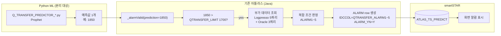

# Q_TRANSFER 알람 분석 — `QTransferPredictBatch._alarmValid()`

> ML 예측값이 임계치 초과 시 smartSTAR UI 에 알람을 표시하기 위한 알람 판정 로직.
> Python ML 은 **예측 숫자만** 주고, 자바가 모든 임계치/조건 판정을 수행한다.

---

## 0. 위치 한눈에

| 항목 | 값 |
|---|---|
| **자바 파일** | `main/java/com/skhynix/smartatlas/batch/QTransferPredictBatch.java` |
| **핵심 메서드** | `_alarmValid(originValue, prediction)` (라인 537~) |
| **호출 흐름** | `execute() → _run() → _predictor() → _alarmValid()` |
| **적재 테이블** | `ATLAS_TS_PREDICT` (예측값 + 알람 행 같이 적재) |
| **소비처** | smartSTAR UI 가 테이블 폴링하여 알람 표시 |
| **총 알람 종류** | **11종** (ALARM1~ALARM11) |

---

## 1. ML 책임 vs 자바 책임



→ **ML 이 줘야 할 것 = 예측 숫자 1개 (double).** 그 외 모든 판정 로직은 자바.

---

## 2. 임계치 (운영변수) — `_findValueByCode()` 로 로드

| 변수 | 기본값 | 코드 라인 | 의미 |
|---|---:|---|---|
| `QTRANSFER_LIMIT` | 1700 | 551 | M14A 반송큐 예측 한계 (★ 가장 중요) |
| `QTRANSFER_INCREASE_RATE` | 10 | 554 | 10m vs 24h 평균 증가율 (%) |
| `VHL_RATE_LIMIT` | 95 | 557 | VHL 가동률 (%) |
| `QTRANSFER_CNV_PORT_DOWN_RATE` | 10 | 558 | CNV 포트 다운율 |
| `QTRANSFER_M14TOM10_PORT_DOWN_RATE` | 25 | 561 | M14→M10 LFT 다운율 |
| `QTRANSFER_M14LFT_PORT_DOWN_RATE` | 10 | 564 | M14 LFT 다운율 |
| `QTRANSFER_ALT_JOB_LIMIT` | 50 | 567 | 대체작업 한계 |
| `QTRANSFER_ALT_JOB_MACHINE_RATE` | 50 | 570 | 대체작업 장비율 |

⚠ 운영변경: `AmosService.alarmParameter(fabId, limitType, value)` 호출 시
`AMOS_ALARM_PARAMETER` 테이블에 적재되어 다음 사이클부터 적용.

---

## 3. 알람 발생 공통 조건 (모든 알람 1~5 의 선결조건)

```java
// QTransferPredictBatch.java:575-581
int m14ATotalCntValue = (int) prediction;

if (m14ATotalCntValue <= reqLimit) {     // 1700 이하면
    return new ArrayList<>();             // 알람 안 생김
}
```

**즉 M14A 반송큐 예측값 > 1700 일 때만** 알람 판정 진행.

---

## 4. ALARM #1 — VHL 가동률 + MES 큐 증가

### 위치
- **빌더 메서드**: `_buildAlarm1(...)` (라인 1402)
- **발생 분기**: 라인 945-955
- **IDCCOL**: `"QTRANSFER_ALARM1"` (라인 1431)

### 발생 조건 (AND)

```java
if (vhlRateFlag && mesQTransFlag) {
    Map<String, Object> alarmMap = this._buildAlarm1(...);
    result.add(alarmMap);
}
```

| # | 조건 | 임계치 |
|---|---|---|
| 1 | M14A 예측 > `QTRANSFER_LIMIT` (1700) | (공통) |
| 2 | VHL 가동률 ≥ `VHL_RATE_LIMIT` (95%) | `vhlRateFlag` |
| 3 | MES 큐 10m/24h 증가율 > `QTRANSFER_INCREASE_RATE` (10%) | `mesQTransFlag` |

### 데이터 수집 (라인 587-619)

| 데이터 | 쿼리 | XML 파일 |
|---|---|---|
| VHL 가동률 (FOUP 타입) | `vhlRunRate` | `customQuery2.xml` |
| 24h MES 반송 큐 | `mesOHTQCntAlarmValid` (duration=24h) | `customQuery2.xml` |
| 10m MES 반송 큐 | 동 (duration=10m) | `customQuery2.xml` |
| 완료 작업 수 | `completedTsJobCountPerMin` | `customQuery2.xml` |

### 증가율 계산식 (라인 614)

```java
double percentageIncrease =
        ((double) (queryResFor10mVal - queryResFor24hVal) / queryResFor24hVal) * 100;
```

### 의미
> **차량이 거의 풀가동(95%↑)인데 MES 반송 요청이 평소보다 10% 이상 늘었다**
> → 차량 부족으로 큐가 쌓일 거다 → **알람!**

---

## 5. ALARM #2 — CNV 반송 증가 + 포트 정상

### 위치
- **빌더 메서드**: `_buildAlarm2(...)` (라인 1443)
- **발생 분기**: 라인 960-971
- **IDCCOL**: `"QTRANSFER_ALARM2"`

### 발생 조건 (AND)

```java
if (m14CnvCntFlag && m14CnvPortDownFlag) {
    Map<String, Object> alarmMap = this._buildAlarm2(...);
    result.add(alarmMap);
}
```

| # | 조건 | 임계치 |
|---|---|---|
| 1 | M14A 예측 > 1700 | (공통) |
| 2 | M14A↔M16 CNV 반송 10m/24h 증가율 > 10% | `m14CnvCntFlag` |
| 3 | CNV PORT DOWN RATE < `QTRANSFER_CNV_PORT_DOWN_RATE` (10%) | `m14CnvPortDownFlag` |

### 데이터 수집 (라인 624-646)

| 데이터 | 쿼리 / IDC_NM | XML |
|---|---|---|
| M14A↔M16 SUM 10m | `transferCountPerMin` (10m), `M14AM16SUM` | `customQuery2.xml` |
| M14A↔M16 SUM 24h | 동 (24h), `M14AM16SUM` | `customQuery2.xml` |
| M14A→M16A 방향 | `M14AM16` | `customQuery2.xml` |
| M16A→M14A 방향 | `M16M14A` | `customQuery2.xml` |
| CNV 포트 다운율 | `bridgeDetailCnvPortDownRate` | `customQuery.xml` |

### 의미
> **M14A ↔ M16 CNV 반송량이 평소보다 10% 늘었는데 + 포트는 정상(다운율 10% 미만)**
> → 정상 포트에 트래픽이 몰려 병목 가능 → **알람!**

---

## 6. ALARM #3 — M14A↔M10A LFT 반송 증가

### 위치
- **인라인 작성** (별도 빌더 없음)
- **발생 분기**: 라인 977-1015
- **IDCCOL**: `"QTRANSFER_ALARM3"` (라인 980)

### 발생 조건 (AND)

```java
if (m14ToM10Flag && m10DownFlag) {
    // 인라인 HashMap 작성
}
```

| # | 조건 | 임계치 |
|---|---|---|
| 1 | M14A 예측 > 1700 | (공통) |
| 2 | M14A↔M10A LFT 반송 10m/24h 증가율 > 10% | `m14ToM10Flag` |
| 3 | LFT 장비/AI·AO PORT DOWN RATE < `QTRANSFER_M14TOM10_PORT_DOWN_RATE` (25%) | `m10DownFlag` |

### 데이터 수집

| 데이터 | 쿼리 / IDC_NM | DB |
|---|---|---|
| M14A↔M10A SUM 10m | `transferCountPerMin`, `M14AM10ASUM` | Logpresso |
| M14A↔M10A SUM 24h | 동 (24h), `M14AM10ASUM` | Logpresso |
| M14A→M10A 방향 | `M14AM10A` | Logpresso |
| M10A→M14A 방향 | `M10AM14A` | Logpresso |
| **M14↔M10 LFT 다운율** | `SELECT_M14TOM10LFT_DOWN_RATE` | **Oracle (M14A 커넥션)** |
| **M14↔M14B LFT 다운율** | `SELECT_M14LFT_DOWN_RATE` | **Oracle (M14B 커넥션)** |
| **M16A 스토리지 사용률** | `SELECT_M16A_STORAGE_UTIL` | **Oracle (M16A 커넥션)** |

⚠ **ALARM3 특이점**: ALARM1/2 는 Logpresso 만 보지만 **ALARM3 부터 Oracle 3종 (M14A, M14B, M16A)** 까지 조회.

### 알람 메시지 (라인 996-998)

```java
alarmRow.put("ALARM_CD",   "");
alarmRow.put("ALARM_CMT",  "- M14A 반송 큐 개수 예측치가 임계치를 초과 했습니다.");  // BOLD
alarmRow.put("ALARM_DESC", "M10A ↔ M14A FAB간 반송 큐 개수 다량 증가");
```

### 의미
> **M14A ↔ M10A LFT 반송량이 10% 늘었는데 + LFT 장비는 정상(다운율 25% 미만)**
> → FAB간 이동에 LFT 부족으로 큐 적체 → **알람!**

---

## 7. ALARM #4 — M14A↔M14B LFT 반송 증가

### 위치
- **인라인 작성**
- **발생 분기**: 라인 1042-1108
- **IDCCOL**: `"QTRANSFER_ALARM4"` (라인 1048)

### 발생 조건 (AND)

```java
if (m14aToM14bFlag && m14aToM14bDownFlag) {
    // 인라인 작성
}
```

| # | 조건 | 임계치 |
|---|---|---|
| 1 | M14A 예측 > 1700 | (공통) |
| 2 | M14A↔M14B 반송 10m/24h 증가율 > 10% | `m14aToM14bFlag` |
| 3 | M14B 측 LFT 다운율 < `QTRANSFER_M14LFT_PORT_DOWN_RATE` (10%) | `m14aToM14bDownFlag` |

### 알람 메시지 (라인 1066-1067)

```java
alarmRow.put("ALARM_CMT",  "- M14A 반송 큐 개수 예측치가 임계치를 초과 했습니다.");
alarmRow.put("ALARM_DESC", "M14A ↔ M14B FAB간 반송 큐 개수 다량 증가");
```

### 메시지 본문 (XmlUtil.getMessage)
- 코드: `"QTRANSFER_M14ATOM14B_LFT"`
- 파라미터: 예측치, 임계치, M14A↔M14B 10m/24h, 다운율, 스토리지 사용률, VHL 가동률 등 12개

---

## 8. ALARM #5 — JOB STATE 이상 패턴

### 위치
- **인라인 작성**
- **발생 분기**: 라인 1111-1150
- **IDCCOL**: `"QTRANSFER_ALARM5"` (라인 1113)

### 발생 조건

```java
if (altJobMachineStateFlag) {
    // 인라인 작성
}
```

| # | 조건 |
|---|---|
| 1 | M14A 예측 > 1700 (공통) |
| 2 | **JOB STATE = ERROR or ALT** 이력의 24h 대비 최근 1h 평균 **50% 이상 증가** |
| 3 | 첫 조건의 JOB 중 **동일 장비명이 50% 이상 발생** |

### 사용 임계치
- `QTRANSFER_ALT_JOB_LIMIT` (50%) — JOB STATE 증가율
- `QTRANSFER_ALT_JOB_MACHINE_RATE` (50%) — 동일 장비 발생률

### 메시지 본문
- 코드: `"QTRANSFER_ALT_JOB"`
- 파라미터: 예측치, 임계치, stateRate, machineRate, totalCnt, mappingMachine, 가동률, JOB 리스트, 장비 리스트

---

## 9. ALARM #6~#11 — Transport 별 알람 (별도 흐름)

### 위치
- **빌더 메서드**: `_buildAlarm6` ~ `_buildAlarm11`
- **호출**: `_buildTransportAlarm()` (라인 1255)
- **분기**: 라인 1301-1341

| 알람 | 빌더 라인 | IDCCOL |
|---|---|---|
| ALARM6 | 1301 | `QTRANSFER_ALARM6` |
| ALARM7 | 1308 | `QTRANSFER_ALARM7` |
| ALARM8 | 1315 | `QTRANSFER_ALARM8` |
| ALARM9 | 1322 | `QTRANSFER_ALARM9` |
| ALARM10 | 1330 | `QTRANSFER_ALARM10` |
| ALARM11 | 1338 | `QTRANSFER_ALARM11` |

→ Transport 카테고리별 알람 (운영 측에서 어떤 게 활성인지 확인 필요).

---

## 10. 11개 알람 비교 매트릭스

| 알람 | 트리거 | DB | 빌더 | 메시지 코드 |
|---|---|---|---|---|
| **ALARM1** | VHL 가동률 + MES 큐 증가 | Logpresso 만 | `_buildAlarm1` L1402 | (빌더 안) |
| **ALARM2** | CNV 반송 + 포트 정상 | Logpresso 만 | `_buildAlarm2` L1443 | (빌더 안) |
| **ALARM3** | M14↔M10A LFT 반송 + 포트 정상 | Logpresso + **Oracle 3** | 인라인 | (XmlUtil.getMessage) |
| **ALARM4** | M14↔M14B LFT 반송 + 포트 정상 | Logpresso + Oracle | 인라인 | `QTRANSFER_M14ATOM14B_LFT` |
| **ALARM5** | JOB STATE ERROR/ALT 50%↑ | Logpresso + Oracle | 인라인 | `QTRANSFER_ALT_JOB` |
| ALARM6~11 | Transport 별 다양한 조건 | 다양 | `_buildAlarm6~11` | 다양 |

---

## 11. 적재 컬럼 (모든 알람 공통)

`ATLAS_TS_PREDICT` 테이블 컬럼 (라인 72-76 + 977-998):

| 컬럼 | 의미 |
|---|---|
| `TIME` | 알람 발생 시각 |
| `IDCCOL` | `QTRANSFER_ALARM1~11` |
| `IDCVAL` | 값 |
| `AVERAGE` | 평균 |
| `SD_LOWER`/`SD_UPPER`/`SD_JUDGE` | 표준편차 하한/상한/판정 (T/F) |
| `STANDARDDEVIATION` | 표준편차 |
| `IQR_Q1`/`Q2`/`LOWER`/`UPPER`/`JUDGE` | IQR 통계 |
| `ALARM_CD` | 알람 코드 |
| `ALARM_CMT` | 알람 코멘트 (BOLD) |
| `ALARM_DESC` | 알람 설명 |
| `ALARM_MSG_CTN` | 알람 메시지 내용 |
| `ALARM_YN` | "Y" / "N" |

---

## 12. 전체 흐름도

```mermaid
flowchart TD
    A[ML 예측 수신<br/>prediction=double] --> B{prediction > QTRANSFER_LIMIT?<br/>(1700)}
    B -- no --> X[알람 없음<br/>빈 결과 반환]
    B -- yes --> C[부가 데이터 수집]

    C --> C1[Logpresso 쿼리 5개<br/>vhlRunRate, mesOHTQCntAlarmValid,<br/>completedTsJobCountPerMin,<br/>transferCountPerMin,<br/>bridgeDetailCnvPortDownRate]
    C --> C2[Oracle 쿼리 3개<br/>SELECT_M14TOM10LFT_DOWN_RATE,<br/>SELECT_M14LFT_DOWN_RATE,<br/>SELECT_M16A_STORAGE_UTIL]

    C1 & C2 --> EVAL[조건 판정]

    EVAL --> A1{ALARM1<br/>VHL 95% & MES 10%↑}
    EVAL --> A2{ALARM2<br/>CNV 10%↑ & 포트정상}
    EVAL --> A3{ALARM3<br/>M14↔M10 10%↑ & LFT정상}
    EVAL --> A4{ALARM4<br/>M14↔M14B 10%↑ & LFT정상}
    EVAL --> A5{ALARM5<br/>JOB ERROR/ALT 50%↑}

    A1 -- yes --> R1[QTRANSFER_ALARM1 row]
    A2 -- yes --> R2[QTRANSFER_ALARM2 row]
    A3 -- yes --> R3[QTRANSFER_ALARM3 row]
    A4 -- yes --> R4[QTRANSFER_ALARM4 row]
    A5 -- yes --> R5[QTRANSFER_ALARM5 row]

    R1 & R2 & R3 & R4 & R5 --> DB[(ATLAS_TS_PREDICT<br/>ALARM_YN=Y)]
    DB --> STAR[smartSTAR UI<br/>화면 표시]
```

---

## 13. 라인 빠른 점프

| 항목 | 라인 |
|---|---|
| `_alarmValid` 진입 | `QTransferPredictBatch.java:537` |
| 임계치 로드 (`_findValueByCode`) | 551-570 |
| 공통 조건 체크 (prediction > limit) | 581 |
| ALARM1 데이터 수집 | 587-619 |
| ALARM2 데이터 수집 | 622-651 |
| ALARM3 (Oracle 포함) 데이터 수집 | 655-755 |
| ALARM1 분기 + 빌더 호출 | 945-955 / `_buildAlarm1` 1402 |
| ALARM2 분기 + 빌더 호출 | 960-971 / `_buildAlarm2` 1443 |
| ALARM3 인라인 작성 | 977-1015 |
| ALARM4 인라인 작성 | 1042-1108 |
| ALARM5 인라인 작성 | 1111-1150 |
| `_buildTransportAlarm` (6~11) | 1255~ |

---

## 14. 분리 시 영향

| 영역 | 변경 필요? |
|---|---|
| ML Python | **변경 없음** (예측 숫자만 주면 됨) |
| 자바 `_alarmValid()` 전체 | **변경 없음** (그대로 사용) |
| 자바 `_predictor()` (Python 호출 부분) | `PythonUtil.executeWithParam` 만 HTTP 어댑터로 |
| 임계치 변수 | **변경 없음** (variable.xml / AMOS_ALARM_PARAMETER) |
| 적재 테이블 | **변경 없음** (`ATLAS_TS_PREDICT`) |
| smartSTAR UI | **변경 없음** (테이블 폴링) |

→ **알람 로직은 자바가 다 가짐. ML 분리해도 알람 시스템 무영향.**

---

## 부록 — 사용되는 쿼리 정리

### Logpresso (`customQuery.xml` / `customQuery2.xml`)

| 쿼리 ID | xml | 라인 | 용도 |
|---|---|---|---|
| `Q_TRANSFER_INPUT_DATA` | `customQuery.xml` | 230 | ML 입력 CSV |
| `vhlRunRate` | `customQuery2.xml` | 586 | VHL 가동률 |
| `mesOHTQCntAlarmValid` | `customQuery2.xml` | 597 | MES 큐 (10m/24h) |
| `completedTsJobCountPerMin` | `customQuery2.xml` | 605 | 완료 작업 수 |
| `transferCountPerMin` | `customQuery2.xml` | 621 | CNV/LFT 반송 (10m/24h) |
| `bridgeDetailCnvPortDownRate` | `customQuery.xml` | 629 | CNV 포트 다운율 |
| `qtransferAltJobCnt` | `customQuery.xml` | 758 | 대체작업 카운트 |
| `altJobMachineRate` | `customQuery.xml` | 788 | 대체 장비율 |
| `altJobMachineRate24h` | `customQuery.xml` | 885 | 24h 대체 장비율 |
| `qtransferAltJobCnt24h` | `customQuery.xml` | 899 | 24h 대체작업 |
| `SELECT_AWS_IDC_HISTORY` | `customQuery.xml` | 1258 | AWS IDC 이력 |

### Oracle (mybatis mapper)

| 쿼리 ID | 커넥션 | 라인 | 용도 |
|---|---|---|---|
| `SELECT_M14TOM10LFT_DOWN_RATE` | M14A | 684 | M14→M10 LFT 다운율 |
| `SELECT_M14LFT_DOWN_RATE` | M14B | 696 | M14 LFT 다운율 |
| `SELECT_M16A_STORAGE_UTIL` | M16A | 1005, 1073, 1460 | M16A 스토리지 사용률 |

---

*문서 끝.*
