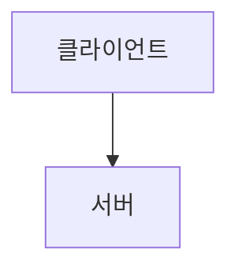

# MD Report — 마크다운 문서/보고서 생성 스킬

사용자가 "MD 파일로 달라", "마크다운으로 정리해줘", "보고서 만들어줘" 등의 요청을 하면,
대화 내용이나 분석 결과를 **구조화된 Markdown 문서**로 생성하여 **다운로드 가능한 파일**로 제공합니다.

---

## 핵심 원칙

1. **즉시 다운로드 가능** — 결과를 코드블록이 아닌 `.md` 파일로 제공
2. **구조화된 포맷** — 제목 계층, 목차, 표, 코드블록 등 올바른 Markdown 문법
3. **한국어 우선** — 제목/본문은 한국어, 코드/수식은 원어 유지
4. **컨텍스트 인식** — 대화 히스토리 전체를 참고하여 빠짐없이 정리

---

## 문서 유형별 템플릿

### 1. 분석 보고서

```markdown
# [분석 주제]

## 개요
- 분석 목적:
- 데이터 출처:
- 분석 기간:

## 주요 발견사항
### 1. [발견 1]
### 2. [발견 2]

## 데이터 요약
| 항목 | 값 | 비고 |
|------|-----|------|

## 시각화 결과
(차트 설명 또는 Mermaid 다이어그램)

## 결론 및 권장사항
1. ...
2. ...

## 부록
- 사용한 도구/패키지
- 참고 문헌
```

### 2. 기술 문서

```markdown
# [기술 문서 제목]

## 목차
1. [개요](#개요)
2. [아키텍처](#아키텍처)
3. [설치 및 설정](#설치-및-설정)
4. [사용법](#사용법)
5. [API 레퍼런스](#api-레퍼런스)
6. [FAQ](#faq)

## 개요
...

## 아키텍처


## 설치 및 설정
```bash
pip install ...
```

## 사용법
### 기본 사용
### 고급 옵션

## API 레퍼런스
| 메서드 | 파라미터 | 반환 | 설명 |
|--------|----------|------|------|

## FAQ
**Q:** ...
**A:** ...
```

### 3. 회의록/미팅노트

```markdown
# 회의록 — [주제]

- **일시**: YYYY-MM-DD HH:MM
- **참석자**:
- **작성자**: AI 어시스턴트

## 안건
1. ...

## 논의 내용
### 안건 1: [제목]
- 주요 발언:
- 결정사항:

## 액션 아이템
| 담당자 | 내용 | 기한 |
|--------|------|------|

## 다음 회의
- 일시:
- 안건:
```

### 4. 연구 보고서 (IMRAD)

```markdown
# [연구 제목]

## 초록 (Abstract)
...

## 서론 (Introduction)
### 배경
### 연구 목적
### 선행 연구

## 방법 (Methods)
### 데이터 수집
### 분석 방법
### 통계 처리

## 결과 (Results)
### 주요 결과
(표, 그래프 설명)

## 고찰 (Discussion)
### 결과 해석
### 한계점
### 향후 연구 방향

## 결론 (Conclusion)

## 참고문헌
1. ...
```

### 5. 프로젝트 보고서

```markdown
# [프로젝트명] 보고서

## 프로젝트 개요
- **기간**:
- **목표**:
- **상태**: 진행중 / 완료

## 진행 현황
### 완료된 작업
- [x] ...

### 진행 중
- [ ] ...

### 미착수
- [ ] ...

## 이슈 및 리스크
| 이슈 | 심각도 | 상태 | 대응방안 |
|------|--------|------|----------|

## 성과 지표
| KPI | 목표 | 현재 | 달성률 |
|-----|------|------|--------|

## 다음 단계
1. ...
```

---

## 출력 규칙

1. **파일 저장**: 반드시 `/api/save_md` 엔드포인트를 통해 `.md` 파일로 저장하고 다운로드 링크 제공
2. **파일명 규칙**: `[주제]_[날짜].md` (예: `데이터분석보고서_2026-03-17.md`)
3. **인코딩**: UTF-8
4. **줄바꿈**: LF (Unix 스타일)

## Markdown 작성 품질 기준

- 제목 계층은 `#` ~ `####` (5단계 이상 사용 금지)
- 표는 정렬 마크다운 사용 (`|:---|:---:|---:|`)
- 코드블록은 반드시 언어 태그 명시 (````python`, ````bash` 등)
- 이미지 참조: `` 형식
- 내부 링크: `[텍스트](#섹션-제목)` 형식
- 수식: `$인라인$` / `$$블록$$` (LaTeX)
- 체크리스트: `- [x]` / `- [ ]` 형식
- 구분선: `---` (섹션 구분용)

## 대화 내용 정리 모드

사용자가 "지금까지 대화 정리해줘"라고 요청하면:

1. 전체 대화 히스토리를 시간순으로 분석
2. 주제별로 그룹핑
3. 핵심 Q&A 추출
4. 코드/분석 결과 포함
5. 결론/다음 단계 도출

```markdown
# 대화 요약 보고서

## 세션 정보
- 일시: YYYY-MM-DD
- 주제: [자동 추출]
- 총 대화 수: N턴

## 주제별 정리
### 1. [주제 1]
**질문**: ...
**답변 요약**: ...
**관련 코드/결과**:

### 2. [주제 2]
...

## 핵심 결론
1. ...

## 후속 작업
- [ ] ...
```

---

## 작성 스타일 대응

| 스타일 | MD 적용 방식 |
|--------|-------------|
| 간결 | 글머리 기호 위주, 설명 최소 |
| 상세 | 각 섹션에 배경/원리/예시 포함 |
| 학술 | IMRAD 구조, 참고문헌, 각주 |
| 실용적 | 코드 예시 중심, 복붙 가능 |
| 데이터 | 표/차트 중심, 수치 강조 |

---

## 함께 사용하면 좋은 스킬

- `markdown-mermaid-writing` — Mermaid 다이어그램 포함 시
- `scientific-writing` — 논문 스타일 보고서
- `docx` — MD → Word 변환 필요 시
- `pdf` — MD → PDF 변환 필요 시
- `exploratory-data-analysis` — 데이터 분석 결과 보고서화
