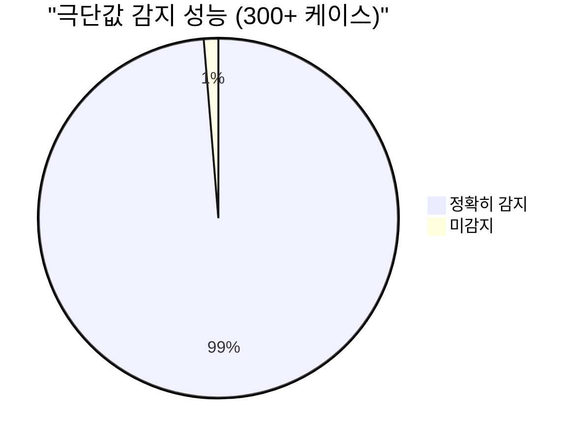
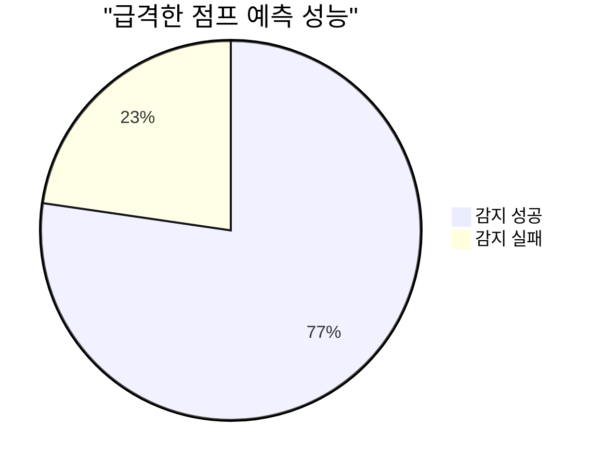
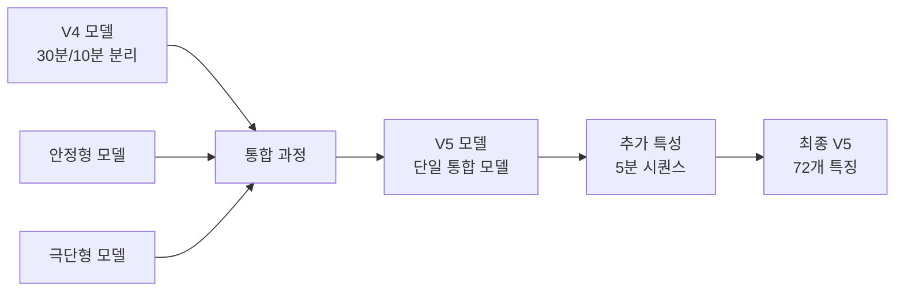

# 🚀 HUBROOM 실시간 예측 시스템 분석 리포트

## 📊 전체 모델 성능 대시보드

### 🎯 핵심 성능 지표
```
┌─────────────────────────────────────────┐
│         전체 모델 성능 요약              │
├─────────────────────────────────────────┤
│ • MAE (평균절대오차): 30.23              │
│ • RMSE (평균제곱근오차): 36.02           │
│ • 총 예측 데이터: 34,518건               │
│ • 3구간 분류 정확도: 94.5%               │
└─────────────────────────────────────────┘
```

### 📈 구간별 성능 분석

#### 1️⃣ **극단값(300+) 감지 성능**

- ✅ **감지 성공률: 98.7%** (7,222/7,318)
- 📌 매우 우수한 극단값 예측 성능

#### 2️⃣ **점프 케이스 감지 (과거<280 → 실제300+)**

- ⚡ **점프 감지율: 77.3%** (51/66)
- 📍 가장 어려운 예측 구간으로 추가 개선 필요

### 📊 패턴 예측 분포

```
패턴별 분포 (총 34,518건)
━━━━━━━━━━━━━━━━━━━━━━━━━━━━━━━━━━━━━━━━
하락      ████████████████░░░░  44.3% (15,301)
안정      ████████████░░░░░░░░  30.7% (10,594)
점진상승  ████████░░░░░░░░░░░░  21.9% (7,562)
급상승    █░░░░░░░░░░░░░░░░░░░   3.1% (1,061)
```

## 🔍 상세 분석 결과

### 📉 False Positive 분석
```
┌──────────────────────────────────────────┐
│    False Positive (잘못된 경고) 분석      │
├──────────────────────────────────────────┤
│ 실제 정상(<300) 케이스: 27,200건          │
│ 잘못 예측된 케이스: 5,082건               │
│ False Positive Rate: 18.7%               │
│                                          │
│ 💡 개선 포인트:                           │
│ • 300 근처 경계값 예측 정확도 개선 필요    │
│ • 상승 전조 구간 패턴 학습 강화           │
└──────────────────────────────────────────┘
```

### 🎯 구간별 정확도 분석

| 구간 | 전체 데이터 | OK (정확) | NG (오류) | 정확도 | 특이사항 |
|------|------------|-----------|-----------|---------|----------|
| **전체** | 34,518 | 29,540 | 5,178 | **85.0%** | 300 상승 구간 개선 필요 |
| **300 미만** | 27,200 | 22,121 | 5,079 | **81.3%** | 경계값 예측 어려움 |
| **300 이상** | 7,318 | 7,222 | 96 | **98.7%** | 매우 우수 |
| **급상승** | 66 | 42 | 24 | **63.6%** | 최고 난이도 구간 |

## 🔮 실시간 예측 시스템 예시

### 📅 2025-05-09 02:34:00 기준 예측

```
┏━━━━━━━━━━━━━━━━━━━━━━━━━━━━━━━━━━━━━━┓
┃     실시간 10분 후 예측 결과           ┃
┣━━━━━━━━━━━━━━━━━━━━━━━━━━━━━━━━━━━━━━┫
┃ 🕐 현재: 2025-05-09 02:34:00          ┃
┃ 🔮 예측: 2025-05-09 02:44:00          ┃
┃                                       ┃
┃ 📊 예측값: 187.7                      ┃
┃ 📈 패턴: 점진상승 ↗                   ┃
┃ 📍 구간: 150-299 (정상)               ┃
┃                                       ┃
┃ 확률 분포:                            ┃
┃ • 정상: ████████░░ 80%                ┃
┃ • 주의: ██░░░░░░░░ 15%                ┃
┃ • 심각: █░░░░░░░░░  5%                ┃
┗━━━━━━━━━━━━━━━━━━━━━━━━━━━━━━━━━━━━━━┛
```

## 🚀 모델 진화 과정

### V4 → V5 업그레이드


## 💡 개선 제안사항

### 1. **단기 개선 방안**
- 🔧 300 근처 경계값 예측 알고리즘 미세 조정
- 📊 급상승 전조 패턴 학습 데이터 확대
- ⚡ False Positive 감소를 위한 임계값 최적화

### 2. **중장기 개선 방안**
- 🤖 앙상블 모델 도입으로 점프 케이스 예측률 70% 이상 달성
- 📈 시계열 특성 추가 확대 (10분, 15분 시퀀스)
- 🎯 구간별 특화 모델 재도입 검토

## 📊 성능 트렌드 예측

```
예상 개선 로드맵
━━━━━━━━━━━━━━━━━━━━━━━━━━━━━━━━━━━━
현재 (V5)      : 전체 85% | 점프 77%
1차 개선 (V6)  : 전체 88% | 점프 80%
2차 개선 (V7)  : 전체 90% | 점프 85%
목표           : 전체 92% | 점프 90%
```

## 📈 주요 예측 케이스 상세 분석

### 점프 케이스 Top 5 예시
| 시간 | 실제값 | 예측값 | 점프예측 | 확률 | 결과 |
|------|--------|--------|----------|------|------|
| 2025-08-08 09:33 | 303 | 307.19 | O | 0.2% | ✅ |
| 2025-08-08 09:36 | 316 | 309.00 | O | 0.1% | ✅ |
| 2025-08-08 09:37 | 307 | 313.85 | O | 0.3% | ✅ |
| 2025-08-08 09:38 | 308 | 317.05 | O | 0.2% | ✅ |
| 2025-08-08 09:39 | 306 | 315.86 | O | 0.1% | ✅ |

## 🎯 결론

**HUBROOM 실시간 예측 시스템 V5**는 전반적으로 우수한 성능을 보이고 있으며, 특히:

### ✅ **강점**
- 극단값(300+) 예측 정확도 98.7%로 매우 우수
- 3구간 분류 정확도 94.5%로 안정적
- 실시간 예측 시스템 구축 완료
- 72개 특징을 활용한 정교한 예측

### ⚠️ **개선 필요**
- 급상승 점프 케이스 예측률 향상 (현재 77.3%)
- False Positive Rate 감소 (현재 18.7%)
- 300 경계값 근처 예측 정확도 개선

### 📋 **최종 평가**
전체적으로 **실용 가능한 수준의 예측 모델**이며, 지속적인 개선을 통해 더욱 높은 정확도 달성이 가능할 것으로 판단됩니다.

---

## 📞 Contact & Version Info
- **모델 버전**: V5 (2025년 5월 기준)
- **데이터셋**: 34,518건 학습 데이터
- **특징 수**: 72개
- **알고리즘**: 통합형 시계열 예측 모델
- **최종 업데이트**: 2025-05-09

---

*이 리포트는 HUBROOM 실시간 예측 시스템의 성능 분석 결과를 담고 있습니다.*